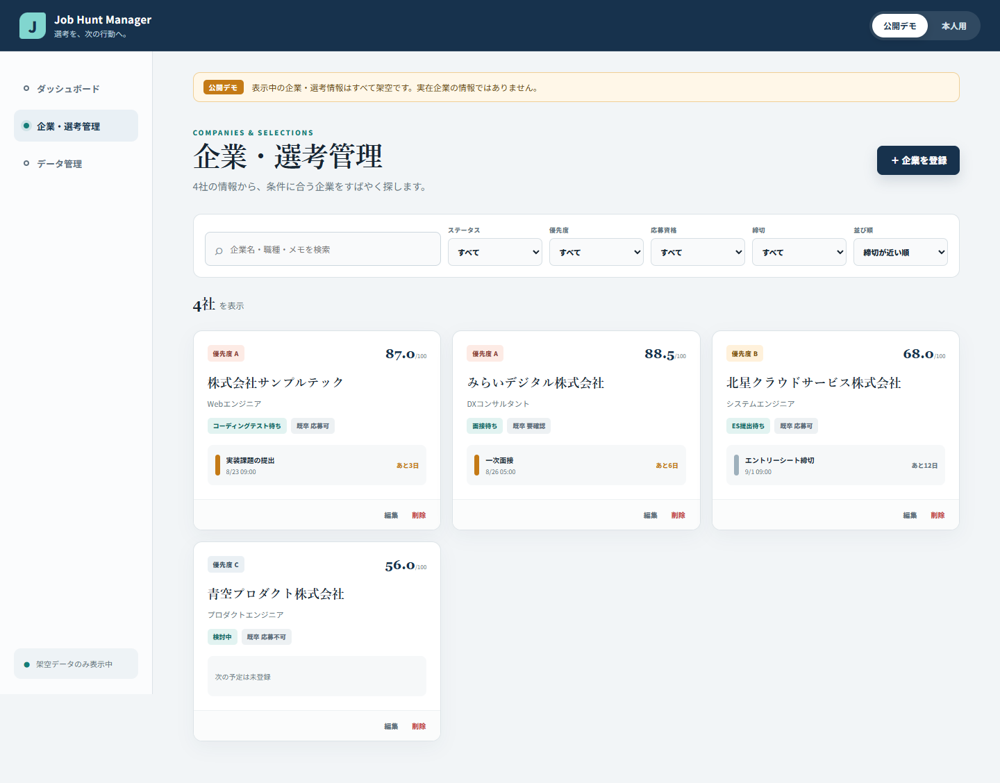
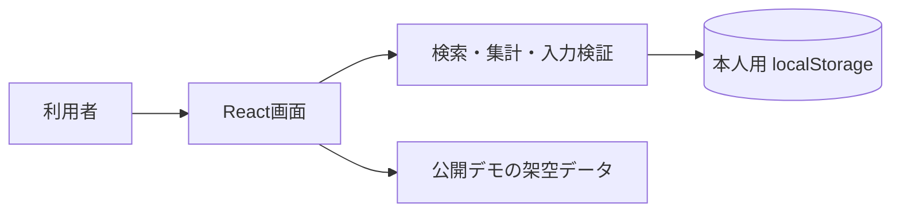

# Job Hunt Manager

企業・応募条件・選考予定・締切・評価を1か所で管理し、「次に何をするか」を見つけやすくする個人用Webアプリです。


## 解決したかった課題

就活では、企業情報、応募資格、テスト形式、ES締切、面接予定、志望度が別々のページやメモへ分散します。応募先が増えるほど、比較と期限管理が難しくなります。

このアプリでは、次の流れを1つにしました。

```text
企業を登録 → 応募条件を比較 → 選考予定を追加 → 締切を確認 → 検索・絞り込み → 次の行動を決める
```

## 主な機能

- 企業の登録・表示・編集・確認付き削除（CRUD）
- 新卒・既卒・職歴あり応募資格、Webテスト、コーディングテストの管理
- 給与、福利厚生、WLB、リモート、フレックス、海外可能性、IT/DX一致の評価
- 志望度を含む100点満点の総合点とランキング
- 1社に複数のES、テスト、面接、締切を登録
- 選考ステータス、期限超過、7日以内の警告
- キーワード検索、4軸フィルター、4種類の並び替え
- 件数、直近予定、状態、ランキングのダッシュボード
- 本人用localStorageと公開デモデータの分離
- 検証付きJSONバックアップ
- PC・スマートフォン幅に対応

## 画面

| 企業一覧 | 企業詳細・選考 |
|---|---|
|  |  |

| スマートフォン幅 |
|---|
|  |

画像・デモデータはすべて架空です。実際の応募状況や面接情報は含みません。

## 技術

- React 19 / TypeScript 5 / Vite 7
- localStorage / JSON
- Vitest / Testing Library
- Playwright（既存Microsoft Edgeを使用）
- ESLint / Git

初版は1人・1ブラウザー用なので、バックエンド、外部DB、Docker、クラウドを入れていません。外部送信と料金をゼロにし、保存処理を分離して将来APIへ置き換えられる構造にしました。詳細は [技術選定](docs/03_TECH_STACK.md) を参照してください。

## システム構成



## Windowsでの起動方法

必要なのは無料の公式Node.js LTSとGitです。Docker、Python、DBサーバーは不要です。

```powershell
corepack enable
corepack prepare pnpm@11.19.0 --activate
pnpm install
pnpm run dev
```

表示された `http://localhost:5173` をEdgeまたはChromeで開きます。Corepackがない場合だけ、Node.js同梱のnpmで `npm install --global pnpm@11.19.0` を実行してから同じ手順へ進みます。

## 品質確認

```powershell
pnpm run lint
pnpm run build
pnpm run test
pnpm run test:e2e
```

開発時の最終結果は、lint成功、build成功、18件のunit/componentテスト成功、3件のEdge E2E成功です。E2Eは登録、検索、詳細、保存、再読み込み、削除を含みます。

## データと安全性

- 公開デモは完全な架空データで、再読み込みすると初期状態へ戻ります。
- 本人用はブラウザーのlocalStorageだけへ保存し、Gitや外部へ自動送信しません。
- localStorageは暗号化保管庫ではありません。共有PCでは本人用モードを使わないでください。
- パスワード、Cookie、APIキー、担当者連絡先は入力しないでください。
- バックアップJSONは自分で安全な場所へ保管してください。

## 工夫した点

- 要件の出典を「明示的に決定済み」と「AI補完」に分けた。
- 企業と選考予定を1対多にし、ES・テスト・面接を同じ形で扱った。
- 保存データを変えずに検索・ランキング・締切警告を派生計算した。
- 実ブラウザーで `crypto.randomUUID()` の接続環境差を発見し、機能検出付きID生成へ修正した。
- 公開デモと本人用を見た目だけでなくデータ経路でも分けた。
- 各フェーズに画像、エラー、復習、面接用説明、理解度チェックを残した。

## AIの利用

このプロジェクトはAI協働開発です。ユーザーが目的・必須機能・安全条件・証跡要件を決め、Codexが過去仕様の復元、設計提案、実装、テスト、修正、文書初稿を支援しました。人間だけで全コードを書いたとは説明しません。詳細は [AI利用記録](docs/06_AI_USAGE.md) と [面接用AI説明](docs/portfolio/AI_USAGE_FOR_INTERVIEW.md) に記録しています。

## ドキュメント

- 初めて読む: [docs/00_START_HERE.md](docs/00_START_HERE.md)
- 要件: [docs/01_REQUIREMENTS.md](docs/01_REQUIREMENTS.md)
- 構成: [docs/02_ARCHITECTURE.md](docs/02_ARCHITECTURE.md)
- 開発証跡: [docs/evidence/INDEX.md](docs/evidence/INDEX.md)
- ポートフォリオ要約: [docs/portfolio/PORTFOLIO_SUMMARY.md](docs/portfolio/PORTFOLIO_SUMMARY.md)
- 面接準備: [docs/portfolio/INTERVIEW_GUIDE.md](docs/portfolio/INTERVIEW_GUIDE.md)

## 今後の改善候補

- 評価ウェイトを本人が変更できる設定
- CSV入出力とカレンダー表示
- 本人の同意と安全設計を前提にした通知
- 複数端末が必要になった場合のAPI・DB移行

## 公開方針

料金が発生する可能性を避けるため、今回はローカル実行とGitHub掲載可能な成果物までです。外部公開・外部DB・課金APIは使用していません。ライセンスは未選択のため、公開前にユーザー本人が利用方針を決める必要があります。
