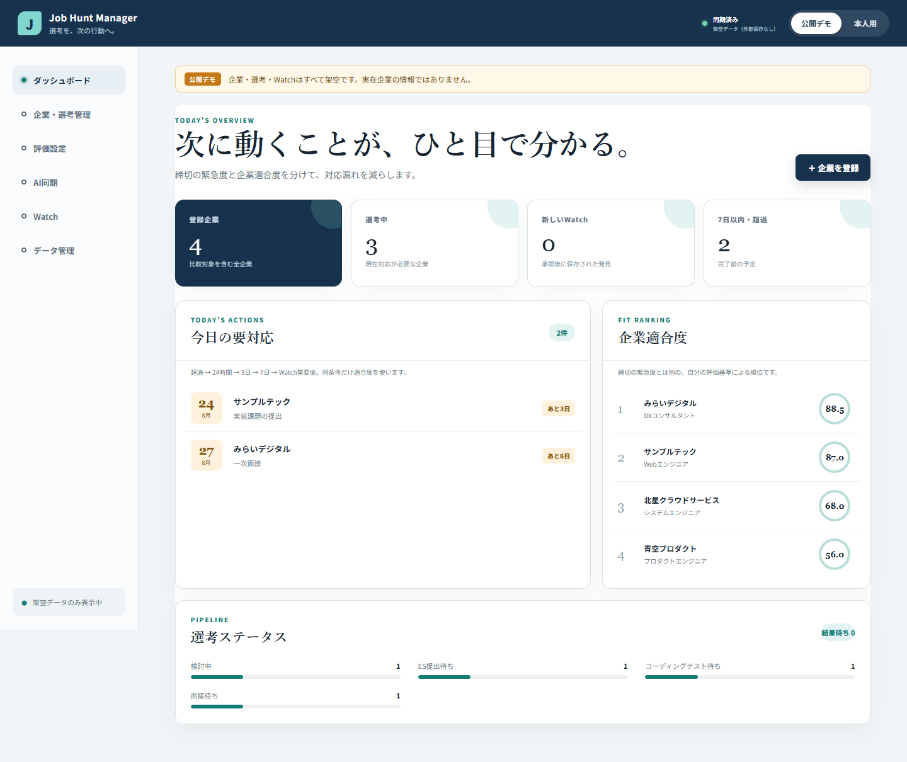
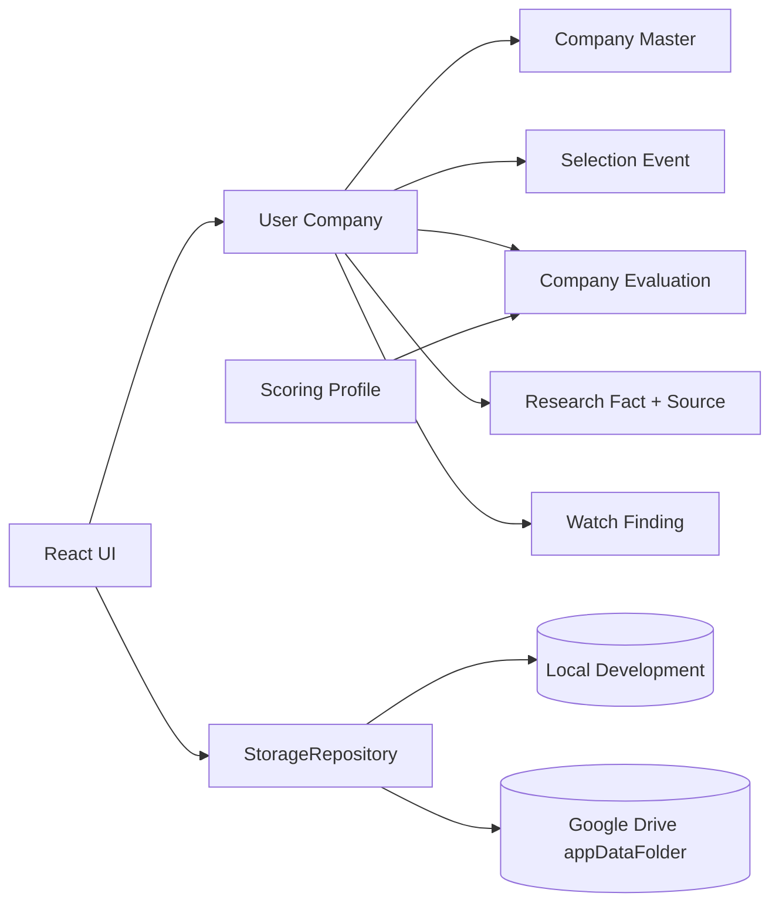

# Job Hunt Manager v2

応募・検討している企業を登録した後、選考、締切、企業評価、採用情報の変化を一元管理し、「次に何をするか」を判断しやすくする個人用Webアプリです。実用品、就活ポートフォリオ、Web開発初心者の学習証跡を同じ重さで作っています。

**公開デモ:** <https://fujishusuke1215-alt.github.io/job-hunt-manager/>

公開URLは完全な架空データだけを使い、本人用保存を無効化したデモ専用buildです。インストールやログインなしで開けます。



画像と同梱デモは完全な架空データです。実企業、実応募状況、実メール、担当者情報は含みません。

## まず使う

Windowsで無料の公式Node.js LTSを入れ、PowerShellでこのフォルダーを開きます。Docker、Python、DBは不要です。

```powershell
corepack enable
corepack prepare pnpm@11.19.0 --activate
pnpm install --frozen-lockfile
pnpm run dev
```

表示された `http://localhost:5173` をEdgeまたはChromeで開きます。画面右上のモードを選びます。

- `公開デモ`: 架空の4社で全画面を試す。再読み込みで初期状態へ戻る。
- `本人用`: 開発時は「ローカル開発モード」と明示してlocalStorageへ保存する。
- Google設定後の本人用: Googleログイン後、Driveの非表示領域 `appDataFolder` を保存先にする。

基本操作は「企業・選考管理 → 企業を登録 → 企業カード → 選考予定やResearch Factを追加」です。評価項目は「評価設定」、ChatGPT等からの候補は「AI同期」、承認した変化は「Watch」で管理します。詳しい手順は [はじめに読む資料](docs/00_START_HERE.md) にあります。

## v2でできること

- User CompanyとCompany Masterを分離し、名称変更に影響されない恒久IDで任意に紐付け
- 企業CRUD、選考イベントCRUD、ステータス、締切、面接、メモ
- 企業名・職種・メモ・Research Fact検索、複合フィルター、4種類の並び替え
- 項目名、説明、最大点、weight、有効/無効、順序を変更できるScoring Profile
- 未評価を0点にしない暫定スコアと評価充足率
- 値、出典、確認日、対象年度、確認レベル、AI整理有無を分けるResearch Fact
- Zodで検証するAI Sync JSON、差分preview、個別選択、追加確認後の反映
- fingerprintで重複を防ぎ、確認・完了・非表示を管理するWatch Center
- 期限緊急度と企業適合度を混同しない「今日の要対応」
- schemaVersion 2 JSONバックアップ、v1 import/migration互換、元v1の保持
- 保存先をUIから分けるStorageRepository
- GIS Token model用AuthProviderとGoogle Drive `appDataFolder` repository
- 公開デモと本人用データの分離、PC/スマートフォン幅対応

## データ構造



Company Masterへの紐付け候補は表示しますが、表記ゆれだけで自動統合しません。ランキングは評価済み項目だけで計算し、充足率100%未満は「暫定」です。

## Google連携の現在地

コードとMock/contractテストは実装済みです。要求scopeは `openid email profile` と `https://www.googleapis.com/auth/drive.appdata` だけで、Gmail scopeはありません。access tokenはメモリだけで扱います。

実GoogleアカウントでのOAuth/Drive接続は未実施です。Client ID作成、本人ログイン、2FAは利用者本人だけが行います。Billing、カード、課金trialは使いません。設定する場合は [Google認証セットアップ](docs/GOOGLE_AUTH_SETUP.md) を読み、実施時点の公式料金と画面を再確認してください。

## AI SyncとWatchの境界

現在の運用は次です。

```text
ChatGPT等で調査 → AiSyncEnvelopeV1 JSON → validation → 差分preview
→ 利用者が個別承認 → Research Fact / Selection Event / Watch Findingへ保存
```

AI出力を読み込んだだけでは本データを変更しません。Gmail自動監視、Web定期巡回、有料AI API、バックグラウンドschedulerは未実装です。仕様は [AI Sync format](docs/09_AI_SYNC_FORMAT.md) と [Watch構成](docs/10_WATCH_ARCHITECTURE.md) にあります。

## 技術

- React 19 / TypeScript 5 / Vite 7 / pnpm 11
- Zod 4による外部JSONのruntime validation
- localStorage（明示的な開発モード）/ Google Drive REST境界
- Google Identity Services Token model境界
- Vitest / Testing Library / Playwright / ESLint / Git
- 独自CSS（UI frameworkなし）

React/Viteを維持し、FastAPI、PostgreSQL、Docker、Next.js、Firebase、有料APIは追加していません。今回の手動同期にはバックエンドが不要で、既存UIと履歴を守る費用対効果が高いためです。

## 品質確認

```powershell
pnpm run lint
pnpm run build
pnpm run test
pnpm run test:e2e
```

2026-08-21の最終確認:

- TypeScript: 成功
- ESLint: 成功
- production build: 成功
- unit/component: 119件成功（24ファイル）
- Microsoft Edge E2E: 機能フロー6件＋証跡撮影2件、計8件成功
- Google Auth/Drive: Mock/contractまで成功、実Googleアカウント未試験

## 安全性

- `.env`、token、password、Cookie、API key、個人データはGitへ入れない。
- URLはhttp/httpsだけを受け付け、HTML文字列を直接挿入しない。
- invalid JSONは現在データを変更しない。
- v1移行前に原文を別keyへ退避し、旧keyも即削除しない。
- Drive保存前にremoteのversionとAppData revisionを再確認し、差分時は自動上書きを止める。
- Drive v3で原子的なETag条件更新を公式保証として確認できていないため、再確認からPATCHまでの競合窓は既知の限界として文書化する。
- Windowsデスクトップ全体を撮影せず、Webアプリだけを架空データで撮影する。

## 学習・ポートフォリオ資料

- [読む順番](docs/00_START_HERE.md)
- [要件](docs/01_REQUIREMENTS.md)
- [構成](docs/02_ARCHITECTURE.md)
- [v2データモデル](docs/07_DATA_MODEL_V2.md)
- [開発証跡 Phase 0〜17](docs/evidence/INDEX.md)
- [ポートフォリオ要約](docs/portfolio/PORTFOLIO_SUMMARY.md)
- [面接ガイド](docs/portfolio/INTERVIEW_GUIDE.md)
- [AI利用記録](docs/06_AI_USAGE.md)

## 公開方針

架空データのproduction build 4ファイルだけをGitHub Pagesへ公開しました。ソースコード、Git履歴、学習資料、本人用データ、Google設定は公開repositoryへ送っていません。

GitHub Pagesは公開repositoryで無料利用し、カード、Billing、有料プラン、カスタムドメインは設定していません。OAuth本番設定と実Google接続は引き続き未実施です。
