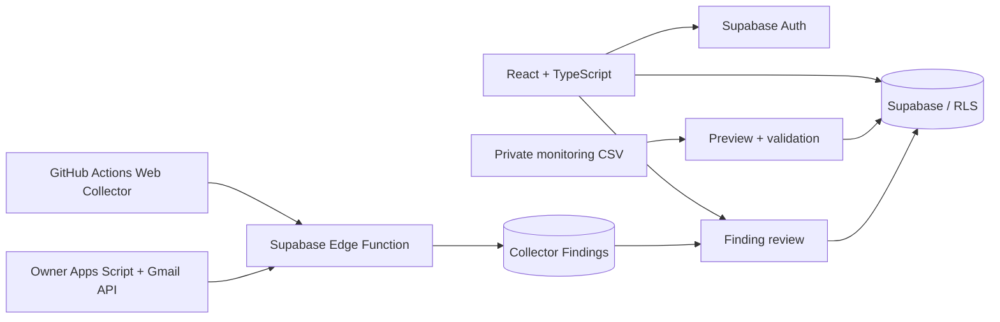

# Job Hunt Manager

就職活動で分散しやすい企業情報、選考状況、締切、評価、更新情報を一元管理する React / TypeScript アプリです。情報を探し回るのではなく、必要な更新を Finding として集め、内容を確認してから正式データに反映する運用を目指しています。

**公開サイト:** https://fujishusuke1215-alt.github.io/job-hunt-manager/

公開サイトには、ログイン不要で試せる完全架空の Demo と、Google Login 後の個人用ワークスペースがあります。Demo に実在企業、実応募状況、メール、アカウント情報は含みません。

## 開発背景

応募候補が増えると、Gmail、企業採用サイト、MyPage、締切、選考状況、企業評価が別々の場所に分かれます。確認作業に時間を取られ、見落としや判断の遅れが起こりやすいことが課題でした。

そこで、企業と選考を管理する画面に加え、メールや公開採用ページの更新を候補情報として収集し、ユーザーが review / approve を経て正式データにする仕組みを実装しました。自動収集の結果をそのまま確定情報にしないことが、このアプリの設計上の重要な点です。

## 主な機能

- Google Login とユーザー単位で分離されたデータ保存
- 企業、選考イベント、締切、評価、Research Fact の管理
- 今日の要対応、直近7日、新着 Finding を確認するダッシュボード
- 評価項目と重み付けを変更できるランキング
- CSV の preview / validation を経由した候補企業と監視対象の初期登録
- Collector Finding の preview、approve、reject と重複防止
- 応募候補の追加・更新から監視対象を派生させる Dynamic Monitoring
- 完全架空データだけで試せる公開 Demo

## 一般公開機能と Owner 専用自動化

一般公開部分は、Google Login、企業・選考・締切・評価の管理、Finding review、Demo、ユーザー分離を提供するアプリです。

一方、Gmail の収集、過去メールの backfill、個人の監視対象の初期投入、公開採用ページの定期収集は **Owner Personal Automation** として分離しています。これは所有者の個人運用向けであり、一般ユーザー向けに Gmail の自動連携を提供するものではありません。通常の Google Login は基本プロフィール情報のみを利用し、Gmail / Drive scope は要求しません。

## Architecture



正式データと Collector Finding を分け、fingerprint と状態管理で重複を抑制しています。Web Collector は正規化したページ内容の差分を扱い、個別サイトの失敗が他サイトの実行を止めないようにしています。

## Security / Privacy

- Supabase Row Level Security によりログインユーザーごとのデータを分離
- Demo はログイン済みデータと分離し、架空データのみを表示
- service role、OAuth secret、collector token、Gmail token はブラウザやリポジトリに置かない
- 個人用の監視 CSV と MyPage 用 private CSV は Git 管理から除外
- Gmail は本文全文や password、認証コードを正式データとして保存しない
- GitHub Actions は secret を workflow の安全な実行コンテキストでのみ参照

公開用の CSV 例は [docs/monitoring-targets.example.csv](docs/monitoring-targets.example.csv) を参照してください。全行が架空の企業と URL です。

## Tech Stack

- React, TypeScript, Vite
- Supabase Auth, Postgres, RLS, Edge Functions
- Google Apps Script / Gmail API（Owner 専用）
- GitHub Actions（公開採用ページの定期監視）
- GitHub Pages

## Setup

```powershell
corepack enable
corepack prepare pnpm@11.19.0 --activate
pnpm install --frozen-lockfile
pnpm run dev
```

環境変数と本番設定は [.env.example](.env.example) および [docs/LIVE_SETUP_CHECKLIST.md](docs/LIVE_SETUP_CHECKLIST.md) を参照してください。実運用では Supabase の Google provider、RLS、Edge Function、GitHub Actions secrets を設定します。個人 Gmail を扱う Owner Personal Automation は公開アプリの通常ログインとは別に設定します。

## Testing

```powershell
pnpm run lint
pnpm run test
pnpm run build
pnpm run test:collector
```

## Future work

- 新規企業を追加したときの企業単位の Gmail 履歴確認フロー
- Collector 実行履歴と stale warning の画面表示の拡充
- 対象企業ごとの収集ルールを UI から調整する機能

詳しい制作意図と面接向けの説明は [docs/PORTFOLIO_DESCRIPTION.md](docs/PORTFOLIO_DESCRIPTION.md) にまとめています。
