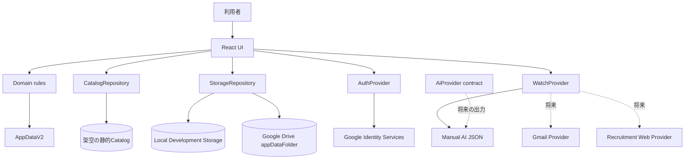
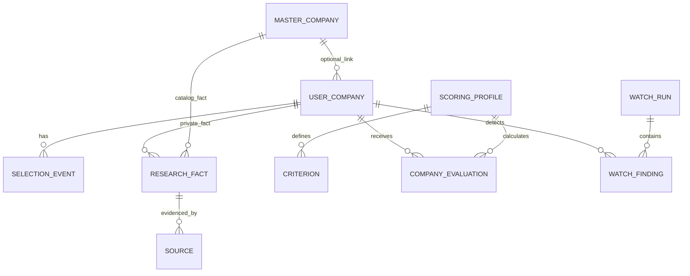

# システム構成 v2

## 全体像



UIはDrive REST、OAuth、localStorageへ直接依存せず、interfaceを通します。将来バックエンドが必要になっても画面全体を書き直さないためです。`AiProvider`は`analyze`/`normalize`の将来用contractだけで、v2には外部AI実装も有料API呼出しもありません。

## データの関係



Master Companyは企業そのもの、User Companyは「自分がその企業をどう受けるか」です。Masterを後からlinkしても選考、メモ、評価、eventを消しません。

## ブラウザー操作から保存まで

1. 利用者がformをsubmitする。
2. componentが`UserCompanyDraft`等をAppへ渡す。
3. domain ruleがrevision/updatedAtを更新する。
4. React stateを更新し、画面を再計算する。
5. Personal modeだけStorageRepositoryのsave queueへ積む。
6. repositoryがruntime schemaを検証する。
7. remote/current versionを確認し、変化があれば上書きを停止する。
8. 保存成功後にsync statusを「同期済み」にする。

キー入力ごとにDriveへ保存せず、submit、status変更、AI commit等の明示単位だけです。

## モード境界

- Demo: `createDemoAppData()`をメモリで扱い、架空の静的Catalogだけを使う。
- Local Development: `VITE_STORAGE_MODE=local`と画面表示を伴い、v1 migrationも行う。
- Google: login後だけrepositoryを作り、`appDataFolder`の1 JSONを扱う。
- Disabled: productionでGoogle設定がない場合、Personal modeを黙ってlocalへfallbackしない。

logoutではaccess token、account表示、personal React state、repository参照をメモリからclearします。

## v1からv2

```text
v1 key検出 → 原文をlegacy keyへ退避 → Zod validation
→ ID/event/memo/time保持 → Legacy v1 profile作成
→ v2を保存して読み戻し確認 → v1 keyは即削除しない
```

出典のなかった応募資格やテスト情報は`legacy / unverified / checkedAt=null`のResearch Factへ移し、確定情報に見せません。

## AI Sync transaction

```text
parse → Zod validate → company match → diff preview → 個別選択
→ delete追加確認 → revision再確認 → commit → import history
```

曖昧な企業候補、重複operationId、不正URL、schema違反は停止します。AIは一次情報ではなく、evidence typeと`processedByAi`を分けます。

## Drive競合の限界

load時とsave直前にDrive file versionとAppData revisionを読み、基準から変わっていればPATCHしません。remote再読込とlocal JSON退避を提示します。Drive API v3の原子的なETag条件更新を公式保証として確認できていないため、事前確認とPATCHの間には小さなrace windowが残ります。実Googleアカウント試験も未実施です。

## 将来バックエンドが必要になる条件

Gmail/採用Webをブラウザーを閉じている間も毎朝監視する場合は、Restricted scopeの審査、tokenの安全なserver保存、scheduler、privacy対応が必要です。今回のSPAに`setInterval`を置いて「毎朝監視」と見せる実装はしていません。
