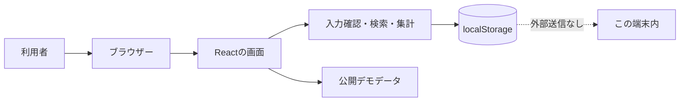
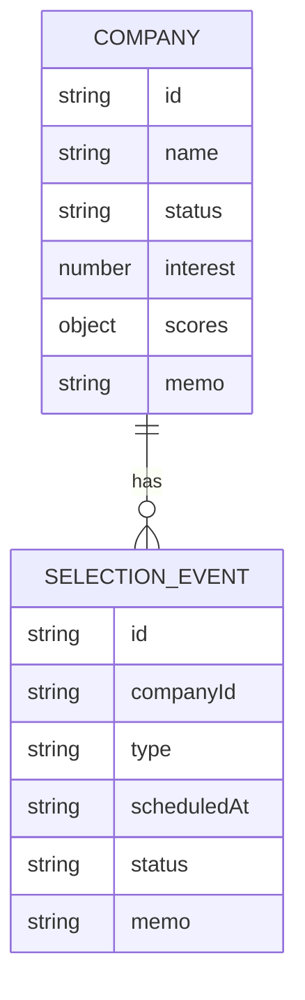

# システム構成

## まず一言で

このアプリは「1つのブラウザーの中で、表示・計算・保存まで完結する」構成です。

## ブラウザーから保存まで

1. 利用者が企業登録フォームへ入力する。
2. Reactが入力値を受け取り、必須項目と値の範囲を確認する。
3. TypeScript上の `Company` という形へまとめる。
4. 本人用モードなら保存サービスがJSON文字列へ変換する。
5. ブラウザーのlocalStorageへ保存する。
6. 一覧とダッシュボードは同じデータから再計算される。

## データ同士の関係

1社の企業は0件以上の選考イベントを持ちます。たとえば「株式会社サンプルA」に「ES締切」「コーディングテスト」「一次面接」の3件を紐づけられます。

## 画面の構成

- ダッシュボード: 件数・ステータス・直近締切・上位企業を確認
- 企業一覧: 検索、フィルター、並び替え、詳細表示
- 企業フォーム: 企業と評価項目の登録・編集
- 選考イベント: 1社に複数の締切や面接を登録・編集・削除
- 設定/データ: 本人用とデモの切替、JSONバックアップ

## なぜバックエンドがないのか

バックエンドは、ブラウザーとは別にデータを預かるサーバーです。複数端末同期や複数利用者には必要ですが、初版の1人・1ブラウザー用には必須ではありません。今回は外部送信と運用費をゼロにし、Reactの状態管理、データ設計、CRUD、テストを理解しやすくすることを優先しました。

## 将来の拡張点

`storage.ts` の保存先をAPIへ置き換えれば、画面の大部分を保ちながらSQLiteやPostgreSQLへ発展できます。これは保存処理を画面から分離する理由でもあります。

