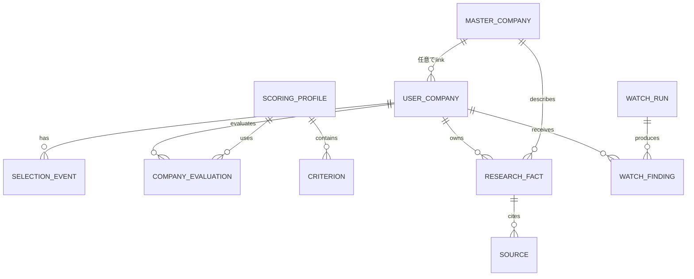

# v2データモデル設計

更新日: 2026-08-21

## 目的

v1の`Company`には、企業そのもの、本人の応募状況、調査結果、評価、選考予定が混在していました。v2では「企業の共通ID」と「本人がその企業をどう扱っているか」を分け、後から保存先や調査手段が増えてもUI全体を書き直さない構造にします。

## 全体像



`MasterCompany.id`は名称から作らない恒久IDです。企業名が変わってもIDを維持します。`merged`になったIDを再利用しないことはCatalog管理上の運用規約です。過去に別企業へ使われたかは現在のJSONだけでは判定できないため、runtime schemaは現在の参照先とmerge循環を検査します。`UserCompany.masterCompanyId`は`null`を許し、カタログにない企業も登録できます。

## 主な型

### MasterCompany

- `id`: 名称非依存の非空ID。同梱Catalogでは識別しやすい`cmp_`接頭辞を採用するが、schemaの必須形式にはしない
- `slug`: URLや表示補助用。主キーではない
- `legalName` / `displayName`
- `aliases[]` / `formerNames[]`
- `officialDomains[]`
- `status`: `active | merged | inactive`
- `mergedIntoId`: canonical masterへの参照

### UserCompany

- `id`: v1移行時は旧`Company.id`を維持
- `masterCompanyId: string | null`
- `userEnteredName`
- `role` / `applicationCategory`
- `manualPriority` / `interest` / `applicationStatus`
- `myPageStatus` / `applicationUrl` / `memo`
- `watchEnabled`
- `events[]`
- `createdAt` / `updatedAt`

### ResearchFact

値だけでなく、年度、確認日、確認状態、AI処理の有無、根拠を保存します。AIは一次情報ではありません。公式ページをAIが整理した場合は`source.type = official_web`かつ`processedByAi = true`です。

`verificationLevel`:

- `official_confirmed`
- `official_interpreted`
- `third_party_correlated`
- `unverified`

`reviewStatus`:

- `draft`
- `confirmed`
- `stale`
- `rejected`

### ScoringProfile / CompanyEvaluation

評価項目は安定したCriterion IDを持ちます。名前や重みを変えてもIDは維持します。企業ごとの値は`CompanyEvaluation.values[criterionId]`へ保存し、未評価は`null`です。

```text
provisionalScore =
  100 × Σ((score / scaleMax) × weight) / Σ(評価済みweight)

coverage =
  100 × Σ(評価済みweight) / Σ(enabled項目weight)
```

未評価を0点として扱いません。評価がなければ総合点を表示せず、coverageが100%未満なら「暫定」と表示します。

### WatchRun / WatchFinding

Watchは「実際に巡回する処理」ではなく、手動AI取込等で得た変化を構造化して管理する領域です。`operationId`と`fingerprint`で重複を防ぎ、完了済みFindingを同一内容の再取込で`new`へ戻しません。

## AppDataV2

個人データの正本は次を含みます。

- `schemaVersion: 2`
- `revision`
- `userCompanies`
- `researchFacts`
- `scoringProfiles`
- `activeScoringProfileId`
- `evaluations`
- `watchRuns` / `watchFindings`
- `userSettings`
- `migrationHistory`
- `aiImportHistory`
- `processedOperationIds`
- `updatedAt`

共通カタログ`CatalogData`は個人AppDataと別です。初期実装は完全な架空企業を含む静的データだけです。

## v1 migration

1. `job-hunt-manager:personal-companies:v1`の原文を読む。
2. 原文を日時付きlegacy backup keyへ複製する。
3. runtime schemaでv1全体を検証する。
4. 企業数、ID、events、memo、時刻を保ってv2へ変換する。
5. 採用情報は`legacy / unverified / checkedAt: null`のResearch Factへ移す。
6. 固定重みを再現する`Legacy v1` profileと評価を作る。
7. v2を保存し、同じ内容を読み戻して検証する。
8. `migrationHistory`へ結果を記録する。
9. v1キーとlegacy backupは削除しない。

不正v1の場合はv2へ書き込まず、現在データも変更しません。

## 企業名候補照合

候補検索ではUnicode NFKC、trim、大小文字、連続空白、法人表記を正規化します。ただし正規化文字列をIDにせず、自動統合にも使いません。

照合順は、明示ID、別名/正式名の完全一致、公式ドメイン一致、候補提示、独自企業登録です。複数候補なら必ず利用者判断へ戻します。

## 不変条件

- Master名は主キーではない。
- Master link変更で本人のメモ・評価・イベントを消さない。
- disabled criterionの値は消さない。
- malformed importは現在データを変更しない。
- DemoとPersonalを同じ保存先へ書かない。
