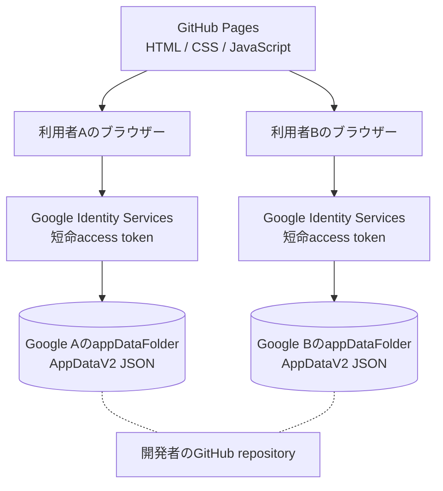

# GitHub Pages公開版とGoogle Drive個人データ分離

更新日: 2026-08-21

## 結論

GitHub PagesはReactアプリの公開ファイルを配信するだけです。本人用の就活データはGitHubへ送らず、接続した各GoogleアカウントのDrive `appDataFolder`へ保存します。中央DBはありません。

破線は「接続しない」を表します。GitHub repositoryへ入るのはソース、架空データ、docs、workflowだけで、A/Bの就活データやaccess tokenは入りません。

## 公開URLとbase path

公開URLは`https://fujishusuke1215-alt.github.io/job-hunt-manager/`です。Viteは`base: './'`を維持し、`/job-hunt-manager/`配下でもJavaScriptとCSSを相対URLで読みます。Client IDはGitHub ActionsのRepository Variableからbuild時に渡します。

## 認証・認可

- `google.accounts.oauth2.initTokenClient()`を使う。
- ユーザーがボタンを押したときだけpopupを開く。
- `openid email profile drive.appdata`以外を拒否する。
- access tokenはproviderのメモリだけに置く。
- 401または期限切れでは自動無限再試行せず、再接続ボタンを出す。
- logoutはtoken参照、account表示、Personal state、Repository参照を先にclearする。

これは純粋な静的GitHub Pagesで少人数試験を行うためのbrowser token modelです。サーバーで検証したログインsessionやrefresh tokenを持つ最終商用構成ではありません。

## 保存・端末移行

Driveには`job-hunt-manager-data-v2.json`を1つ作ります。起動時に`spaces=appDataFolder`だけを検索し、ZodでAppDataV2を検証してから表示します。

端末localStorageにv1/v2が残っている場合は次を表示します。

- Driveが空: `移行する / 新規で開始 / キャンセル`
- Driveと端末の両方にデータ: 両方の更新日時と`Driveを使用 / 端末から上書き / JSON退避`

自動統合、自動上書き、端末原文の即削除はしません。

## 同期と競合

企業登録、予定変更、評価保存、AI Sync承認などの確定操作でだけ保存します。Driveの`version`とAppDataの`revision`が前回load時と違えばPATCHを止め、local案をJSON退避します。

Drive API v3で原子的な`If-Match`更新を公式保証として確認できていないため、事前確認とPATCHの間には小さなrace windowが残ります。複雑な共同編集が必要になった時点で、backendと原子的な保存方式を再検討します。

## できないこと

- ブラウザーを閉じている間の同期
- 毎朝の自動実行
- Gmail自動監視
- 採用ページ自動巡回
- Push通知
- token期限後の無操作再認可

将来大規模な一般公開サービスにする場合は、Authorization Code Flow、backend、server側session/token管理を再評価します。

## 料金

GitHub Pagesは公開repositoryでGitHub Freeを使用します。Google Drive APIは2026-08-21時点で標準利用に追加費用なしと案内されていますが、quota超過課金方針は変更され得ます。本プロジェクトではBilling account、カード、quota引上げ、有料trialを設定せず、要求された場合は中止します。

公式資料:

- [GIS Token model](https://developers.google.com/identity/oauth2/web/guides/use-token-model)
- [Drive appDataFolder](https://developers.google.com/workspace/drive/api/guides/appdata)
- [Drive error handling](https://developers.google.com/workspace/drive/api/guides/handle-errors)
- [GitHub Pages](https://docs.github.com/en/pages/getting-started-with-github-pages)
