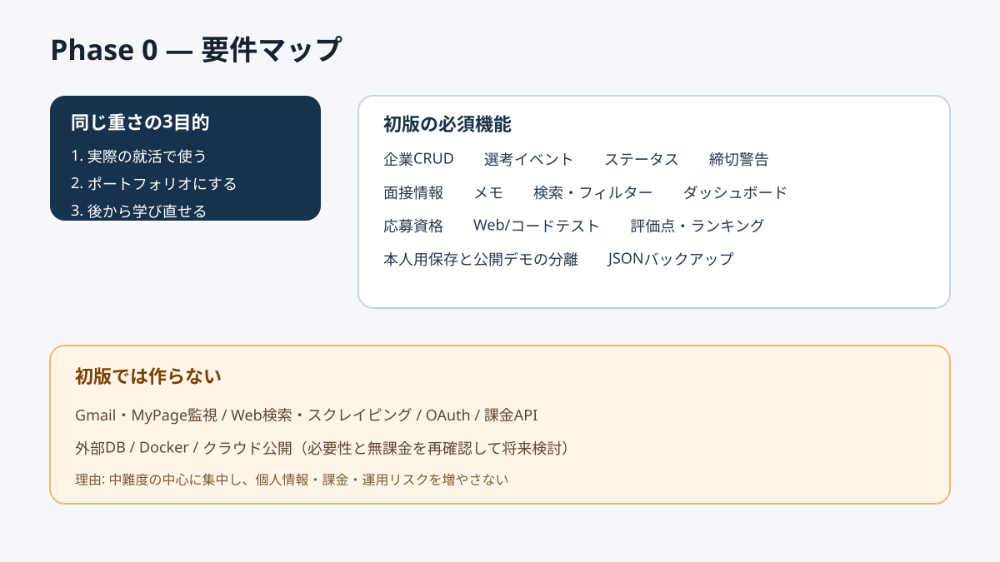

# Phase 0: 要件復元

## 1. このフェーズで何をしたか
参照会話と最新指示を比較し、実用品・成果物・学習証跡という3目的、必須機能、対象外、安全条件を確定しました。

## 2. なぜこの作業が必要なのか
コードを先に書くと、必要ないクラウド機能を作ったり、肝心の締切管理が不足したりします。完成判定の基準を先に作るためです。

## 3. 作業前はどういう状態だったか
過去案にはReact/FastAPI/PostgreSQL/Docker/Renderがあり、最新指示には無課金・必要最小限・外部DB不要なら導入しないという条件がありました。

## 4. 何を変更したか
`docs/01_REQUIREMENTS.md` に明示済みとAI補完を分け、初版に作る機能と作らない機能を記録しました。

## 5. 作業後どうなったか
企業・選考・期限・評価・検索・ダッシュボード・デモ分離を初版に含め、自動調査・外部連携を将来機能とする基準ができました。

## 6. スクリーンショット

## 7. スクリーンショットの見方
中央の3目的が同じ重さで、右側に初版機能、下側に対象外が分かれている点を見ます。

## 8. 変更した主なファイル
- `docs/01_REQUIREMENTS.md`: 完成条件を含む要件
- `docs/ASSUMPTIONS.md`: AIが補った変更可能な判断

## 9. 使用した主なコマンド
- `git status`: 既存の未コミット変更がないか確認する。
- `git init -b main`: mainという最初の履歴線でGit管理を始める。

## 10. 発生したエラー
参照会話の1回目の読み取りで、1項目の最大文字数指定が上限を超えました。

## 11. 原因
読み取り機能は1項目20,000文字までですが、30,000文字を指定していました。

## 12. どう直したか
上限を20,000文字へ修正し、アプリに関係するターンだけを抽出しました。

## 13. このフェーズで覚える言葉
要件、スコープ、非機能要件、仮定。

## 14. 面接用30秒説明
「過去の要望と最新制約を照合し、明示要件とAI補完を分離しました。無課金と学習範囲を優先し、初版は外部連携を除いて企業・選考・締切管理へ集中しました。」

## 15. 理解度チェック
1. なぜコードより先に要件を決めますか。
2. 明示要件とAI補完を分ける理由は何ですか。
3. Gmail連携を初版から外した理由は何ですか。

## 16. 理解度チェックの答え
1. 完成基準を作り、不要機能や不足を防ぐため。
2. 誰が何を決めたかを誠実に説明し、仮定を変更可能にするため。
3. 認証・個人情報・外部API・運用の複雑さが大きく、中難度の中心課題ではないため。

## スクリーンショット安全確認
要件図は抽象化した機能名だけで、実企業名・氏名・応募状況を含みません。

## 5分復習
- 覚える3点: 3つの目的、初版の必須機能、初版の対象外。
- 覚えなくてよい: 要件文書の全ての表現。
- 面接までに: 「なぜ外部連携を外したか」を30秒で説明する。
