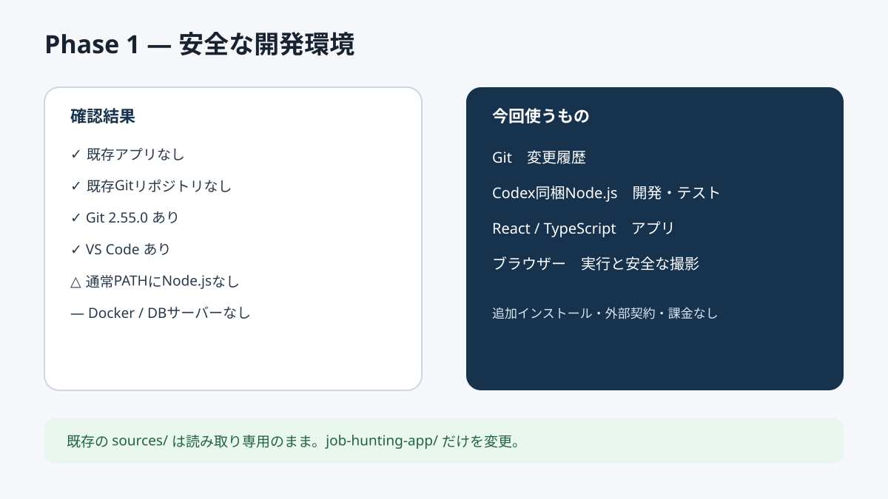

# Phase 1: 環境確認とGit

## 1. このフェーズで何をしたか
作業場所、既存プロジェクト、Git状態、Git・Node.js・VS Code等の有無を読み取り専用で確認し、新しい `job-hunting-app` を作りました。

## 2. なぜこの作業が必要なのか
ユーザーの既存ファイルや未コミット変更を上書きせず、必要ないソフトを入れないためです。

## 3. 作業前はどういう状態だったか
作業ルートには読み取り専用の `sources/` と `AGENTS.md` だけがあり、Gitリポジトリはありませんでした。Git 2.55.0とVS Codeはあり、通常PATHにはNode.js/npm/Python/Dockerがありませんでした。

## 4. 何を変更したか
新規フォルダを作り、Gitをmainブランチで初期化しました。実在人物を示すGit情報は設定せず、必要な場合だけ予約ドメイン `.invalid` のローカル識別子を使いました。

## 5. 作業後どうなったか
既存資料に触れず、フェーズ単位で履歴を残せる独立プロジェクトができました。開発にはCodex同梱のNode.jsを使うため、追加インストールはしていません。

## 6. スクリーンショット

## 7. スクリーンショットの見方
「確認結果」と「今回使うもの」を見ます。Dockerや外部DBを追加していない点が重要です。

## 8. 変更した主なファイル
- `.git/`: Gitが自動作成した履歴管理情報
- `.gitignore`: 秘密情報や生成物を追跡しない規則

## 9. 使用した主なコマンド
- `git --version`: Gitの有無と版を確認。
- `git status --short --branch`: 現在の履歴線と未保存変更を確認。
- `git init -b main`: 新しいリポジトリを開始。

## 10. 発生したエラー
通常のターミナル検索ではNode.jsとnpmが見つかりませんでした。

## 11. 原因
ユーザー環境のPATHにNode.jsが登録されていないためです。

## 12. どう直したか
今回はCodexが安全に提供する同梱Node.jsを使います。ユーザーが後で直接開発するときだけ、無料の公式Node.js LTSを入れればよく、現時点では不要なPC変更をしません。

## 13. このフェーズで覚える言葉
PATH、Git、repository、commit、`.gitignore`。

## 14. 面接で聞かれた場合の説明例
「既存物と未コミット変更を最初に確認し、独立フォルダでGitを初期化しました。通常環境にNode.jsがなかったため、開発中は同梱ランタイムを使い、不要なDockerやDBは導入しませんでした。」

## 15. 理解度チェック
1. `.gitignore` は何を防ぎますか。
2. なぜ既存ファイル確認が先ですか。
3. Node.jsをすぐPCへ追加しなかった理由は何ですか。

## 16. 理解度チェックの答え
1. 秘密情報、依存パッケージ、生成物等の誤追跡。
2. 既存成果や未コミット変更を壊さないため。
3. 同梱環境で開発でき、追加インストールがまだ直接必要ないため。

## 5分復習
- 覚える3点: Gitは履歴、`.gitignore` は除外規則、環境確認は既存物保護。
- 覚えなくてよい: 実行ファイルの長い絶対パス。
- 面接までに: Gitを最初から使った理由を説明する。

