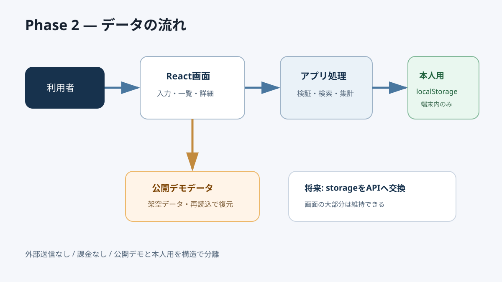

# Phase 2: システム・画面・データ設計

## 1. このフェーズで何をしたか
ブラウザー内完結の構成、企業と選考イベントの関係、画面区分、保存境界を設計しました。

## 2. なぜこの作業が必要なのか
画面に直接保存処理を混ぜると、将来APIへ変えにくくテストもしにくくなります。役割を分けるためです。

## 3. 作業前はどういう状態だったか
必須項目は決まりましたが、どのデータをどこへ保存し、画面がどう読むかは未定でした。

## 4. 何を変更したか
React画面、計算処理、保存サービス、本人用localStorage、公開デモデータの境界を決めました。1社が複数選考イベントを持つ形にしました。

## 5. 作業後どうなったか
型定義、保存処理、画面部品を独立して実装・テストできる設計になりました。

## 6. スクリーンショット

## 7. スクリーンショットの見方
入力がReactへ入り、計算を経て本人用localStorageへ保存される流れと、公開デモが別経路である点を見ます。

## 8. 変更した主なファイル
- `docs/02_ARCHITECTURE.md`: 構成とデータ関係
- `docs/03_TECH_STACK.md`: 採用理由と代替案

## 9. 使用した主なコマンド
このフェーズは文書設計が中心です。後で `npm run test` により境界ごとに確認します。

## 10. 発生したエラー
実行エラーはありません。設計上、過去案のバックエンド導入と最新の最小構成が競合しました。

## 11. 原因
過去案はフルスタック経験、最新指示は無課金・安全・不要なインフラ回避を優先していたためです。

## 12. どう直したか
保存処理をサービスとして分離し、初版はlocalStorage、将来はAPIへ交換できる境界を作る方針にしました。

## 13. このフェーズで覚える言葉
フロントエンド、状態、永続化、1対多、責務分離。

## 14. 面接用30秒説明
「初版は1人用なので外部DBを使わずlocalStorageへ保存しました。ただし保存処理を画面から分離し、将来APIへ置き換えられる構造にしています。公開デモは別の架空データ経路にしました。」

## 15. 理解度チェック
1. 1社と選考イベントはどんな関係ですか。
2. 保存処理を分ける利点は何ですか。
3. デモと本人用を分ける理由は何ですか。

## 16. 理解度チェックの答え
1. 1社が0件以上の選考イベントを持つ1対多。
2. テストしやすく、将来保存先を交換しやすい。
3. 実データを公開成果物へ混ぜないため。

## スクリーンショット安全確認
構成図は架空データの流れだけを示し、個人情報・秘密情報・実際の応募先を含みません。

## 5分復習
- 覚える3点: ブラウザー内完結、1対多、保存境界。
- 覚えなくてよい: Mermaidの記法。
- 面接までに: 「なぜバックエンドを使わなかったか」を説明する。
