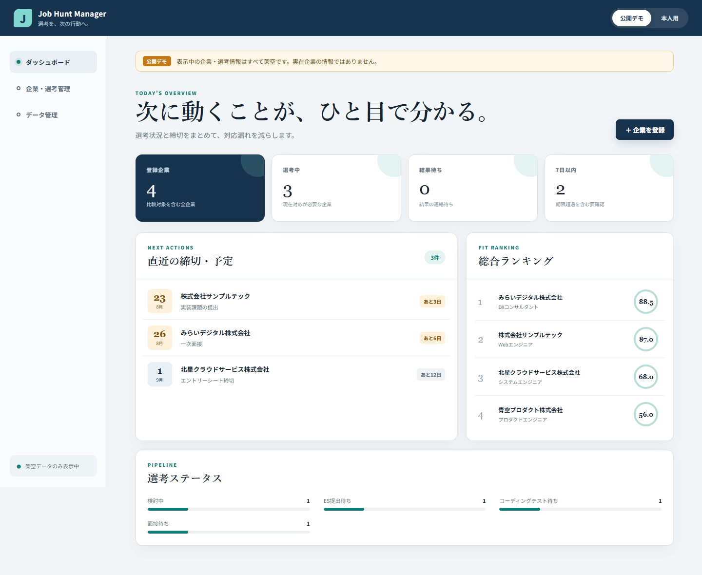

# Phase 3: 最初のWebアプリ起動

## 1. このフェーズで何をしたか
React/TypeScript/Viteの最小構成を作り、共通ヘッダー、メニュー、公開デモ表示、ダッシュボードを起動しました。
## 2. なぜこの作業が必要なのか
設計を実際のブラウザーで表示できる土台へ変えるためです。
## 3. 作業前はどういう状態だったか
要件・設計文書とGit履歴だけで、Web画面はありませんでした。
## 4. 何を変更したか
`package.json`、`index.html`、`src/main.tsx`、`src/App.tsx`、画面部品とCSSを追加しました。
## 5. 作業後どうなったか
ローカルURLから公開デモのダッシュボードを表示でき、4社の架空データを集計できました。
## 6. スクリーンショット

## 7. スクリーンショットの見方
上部の「公開デモ」、4つの集計、直近締切、ランキング、選考ステータスを見ます。
## 8. 変更した主なファイル
- `src/main.tsx`: ReactをHTMLへ取り付ける入口
- `src/App.tsx`: モード・画面・企業データをつなぐ中心
- `src/styles.css`: 配色、配置、狭い画面への対応
## 9. 使用した主なコマンド
- `pnpm install`: 必要な無料パッケージを取得。
- `pnpm run dev`: 開発用ローカルサーバーを起動。
- `pnpm run build`: 配布可能な完成版を生成。
## 10. 発生したエラー
初回の依存取得はネットワーク制限で拒否され、esbuildの安全確認後はNode.jsが通常PATHにないためセットアップが失敗しました。
## 11. 原因
保護環境のネットワーク制限と、Codex同梱Node.jsがWindows全体のPATHへ登録されていないためです。
## 12. どう直したか
公式npmレジストリだけを許可し、esbuildだけを明示承認し、コマンド中だけNode.jsの場所を指定しました。
## 13. このフェーズで覚える言葉
React、Vite、Node.js、package、localhost、build。
## 14. 面接用30秒説明
「ReactとTypeScriptで画面の土台を作り、最初から公開デモ表示とダッシュボードを用意しました。開発用サーバーと本番buildの両方を確認しています。」
## 15. 理解度チェック
1. Reactは何を担当しますか。 2. Viteは何をしますか。 3. localhostとは何ですか。
## 16. 理解度チェックの答え
1. 状態に応じた画面。2. 開発起動とbuild。3. 自分のPC内のWebサーバーを指す名前。
## スクリーンショット安全確認
架空企業だけで、氏名・メール・パスワード・APIキー・Windowsデスクトップは写っていません。
## 5分復習
- 覚える3点: React=画面、Vite=起動/build、localhost=PC内。
- 覚えなくてよい: 依存パッケージの全バージョン。
- 面接までに: ブラウザーへ画面が出るまでを説明する。
