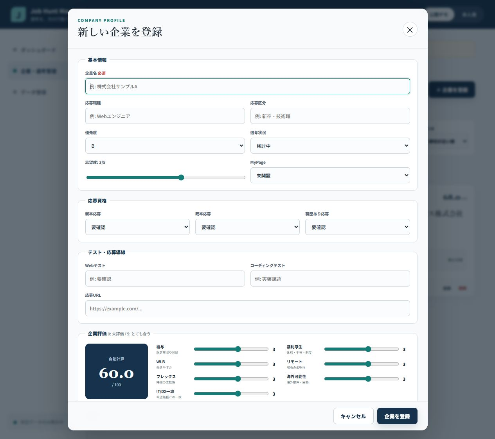

# Phase 4: 企業管理（CRUD）

## 1. このフェーズで何をしたか
企業の登録、一覧、詳細、編集、確認付き削除と、応募条件・テスト・評価項目を実装しました。
## 2. なぜこの作業が必要なのか
分散している企業情報を1社単位で整理し、比較可能にする中心機能だからです。
## 3. 作業前はどういう状態だったか
ダッシュボードに架空データを表示できましたが、利用者が企業を変更できませんでした。
## 4. 何を変更したか
`CompanyForm.tsx`、`CompanyList.tsx`、`CompanyDetail.tsx`、総合点計算を追加しました。
## 5. 作業後どうなったか
Create/Read/Update/Deleteの4操作を画面から行えます。
## 6. スクリーンショット

## 7. スクリーンショットの見方
一覧では優先度・点数・状態・直近予定、フォームでは要件で決めた全評価軸を確認します。
## 8. 変更した主なファイル
- `src/types.ts`: Companyのデータ形
- `src/components/CompanyForm.tsx`: 登録・編集
- `src/utils/scoring.ts`: 100点換算
- `src/utils/id.ts`: 環境差に耐えるID生成
## 9. 使用した主なコマンド
- `pnpm run lint`: 使わない変数などを検出。
- `pnpm run test`: CRUDを含む画面操作を自動確認。
## 10. 発生したエラー
LAN内URLで企業登録すると `crypto.randomUUID is not a function` となり、画面が停止しました。
## 11. 原因
`randomUUID` はブラウザーの安全な接続条件に依存し、HTTPのLANアドレスでは利用できない場合があります。テストでは代替値を入れていたため見逃しました。
## 12. どう直したか
`createId()` を作り、randomUUIDが使える場合は使用し、使えない場合は時刻と乱数からIDを作るようにしました。修正後に同じブラウザー操作で登録成功を確認しました。
## 13. このフェーズで覚える言葉
CRUD、form、validation、ID、secure context。
## 14. 面接で聞かれた場合の説明例
「企業CRUDと多項目フォームを実装しました。実ブラウザーでID生成の環境差を見つけ、機能検出を使う代替処理へ分離して修正しました。」
## 15. 理解度チェック
1. CRUDの4語は何ですか。2. IDはなぜ必要ですか。3. 単体テストだけで見逃した理由は何ですか。
## 16. 理解度チェックの答え
1. 登録・表示・更新・削除。2. 企業を重複なく識別するため。3. 実ブラウザーの接続条件が異なったため。
## スクリーンショット安全確認
企業名・職種・URL例は完全なダミーで、入力値は空です。
## 5分復習
- 覚える3点: CRUD、Company型、randomUUIDの実バグ。
- 覚えなくてよい: CSSの細かな数値。
- 面接までに: エラー→原因→再発防止を説明する。

