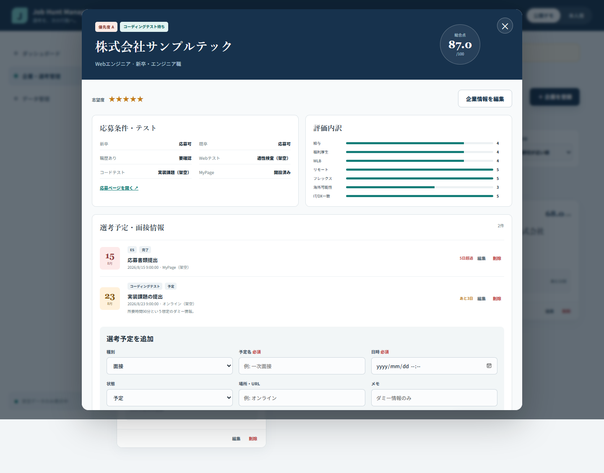

# Phase 5: 選考・面接管理

## 1. このフェーズで何をしたか
1社に複数のエントリー、ES、テスト、面接などを登録・編集・削除できるようにしました。
## 2. なぜこの作業が必要なのか
企業の状態だけでは、複数の締切と面接日時を管理できないためです。
## 3. 作業前はどういう状態だったか
企業単位のCRUDはありましたが、予定ごとの日時・状態・場所・メモは変更できませんでした。
## 4. 何を変更したか
`SelectionEvent` 型とイベントフォーム、一覧、期限ラベル、状態編集を追加しました。
## 5. 作業後どうなったか
1社対複数予定の関係を保ち、面接情報と締切を同じ構造で管理できます。
## 6. スクリーンショット

## 7. スクリーンショットの見方
上半分の応募条件と評価、下半分の2件の予定、さらに追加フォームが同じ企業詳細内にある点を見ます。
## 8. 変更した主なファイル
- `src/types.ts`: SelectionEvent型
- `src/components/CompanyDetail.tsx`: 予定CRUD
- `src/utils/deadlines.ts`: 残日数と警告色
## 9. 使用した主なコマンド
- `pnpm run test`: 予定追加と状態変更を自動確認。
- `pnpm run test:e2e`: 実ブラウザーで企業詳細まで確認。
## 10. 発生したエラー
内蔵ブラウザーの日時入力は自動入力形式を受け付けず、必須入力エラーになりました。
## 11. 原因
`datetime-local` はブラウザーや自動操作面によって入力方法が異なるためです。アプリの検証処理自体は正しく、空値を拒否しました。
## 12. どう直したか
機能確認はTesting Libraryと既存EdgeのPlaywright E2Eで行い、内蔵ブラウザーではエラー表示が利用者へ伝わることを確認しました。
## 13. このフェーズで覚える言葉
1対多、SelectionEvent、datetime-local、状態遷移。
## 14. 面接用30秒説明
「企業と選考予定を1対多にし、ESや面接を同じイベント型で管理しました。追加だけでなく状態変更と削除もテストしています。」
## 15. 理解度チェック
1. なぜ企業の次回期限1個だけでは不足しますか。2. 1対多とは何ですか。3. 日時空欄時はどうなりますか。
## 16. 理解度チェックの答え
1. 複数工程を失うため。2. 1社が複数予定を持つ関係。3. 保存せずエラーを表示する。
## スクリーンショット安全確認
選考名、場所、メモ、企業はすべて架空です。
## 5分復習
- 覚える3点: 1対多、予定CRUD、入力検証。
- 覚えなくてよい: 日付表示の書式指定。
- 面接までに: CompanyとSelectionEventの関係を図なしで説明する。
