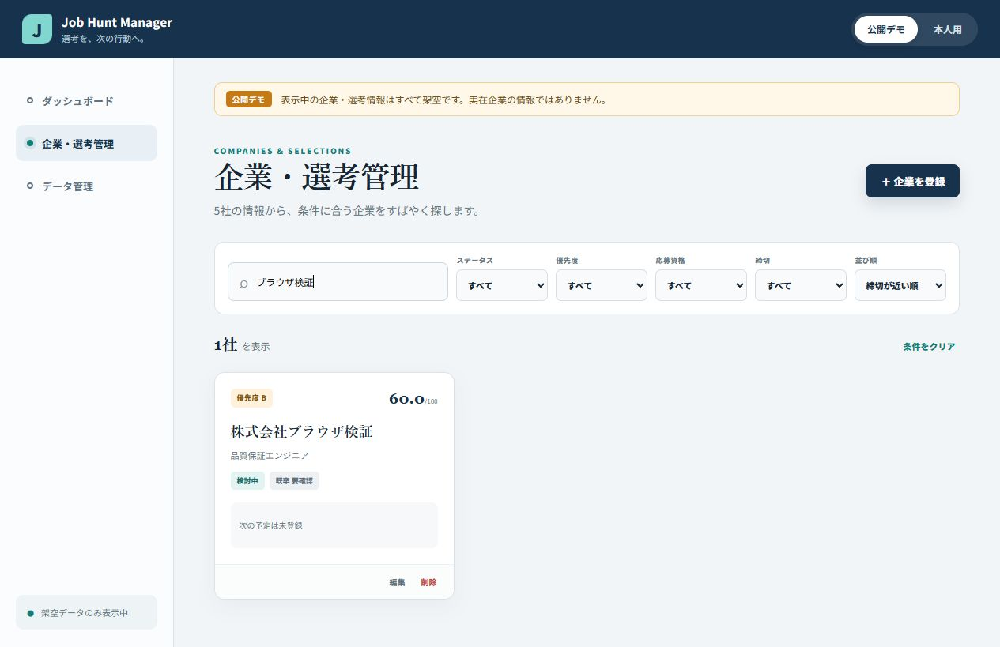

# Phase 6: 検索・フィルター・ダッシュボード

## 1. このフェーズで何をしたか
検索、ステータス・優先度・応募資格・締切の絞り込み、4種類の並び替え、集計とランキングを実装しました。
## 2. なぜこの作業が必要なのか
登録するだけでは、企業数が増えたときに次の行動を見つけにくいためです。
## 3. 作業前はどういう状態だったか
企業カードを一覧表示できましたが、全件から目視で探す必要がありました。
## 4. 何を変更したか
`companyFilters.ts`、フィルターUI、件数・状態・直近締切・総合点の派生計算を追加しました。
## 5. 作業後どうなったか
入力のたびに該当企業だけへ絞られ、保存データを変えずに並び順と集計を変えられます。
## 6. スクリーンショット

ダッシュボードは [Phase 3の画像](../phase-03-first-app/01-dashboard.png) を参照します。
## 7. スクリーンショットの見方
検索語「ブラウザ検証」に対して、5社中1社だけが表示される点を見ます。
## 8. 変更した主なファイル
- `src/utils/companyFilters.ts`: 絞り込みと並び替え
- `src/components/CompanyList.tsx`: 条件UI
- `src/components/Dashboard.tsx`: 集計とランキング
## 9. 使用した主なコマンド
- `pnpm run test`: 検索、複合条件、総合点順を確認。
- ブラウザー操作: 実際に検索語を入力しカード1件を確認。
## 10. 発生したエラー
内蔵ブラウザーで検索欄を `fill("")` しても空にならない操作上の差がありました。
## 11. 原因
ブラウザー操作面の空文字入力処理が通常の入力イベントと異なったためです。
## 12. どう直したか
全選択後にBackspaceを送って空欄化し、5社へ戻ることを確認しました。アプリ側の検索テストは別途成功しています。
## 13. このフェーズで覚える言葉
filter、sort、derived data（保存値から計算する値）。
## 14. 面接で聞かれた場合の説明例
「保存データを変更せず、検索・複合フィルター・並び替え・ダッシュボードを派生計算しています。計算処理を画面から分離して単体テストしました。」
## 15. 理解度チェック
1. 検索結果は保存されますか。2. 派生データとは何ですか。3. 総合点順はどこで計算しますか。
## 16. 理解度チェックの答え
1. されない。2. 元データから都度計算する値。3. scoringとfilterの関数。
## スクリーンショット安全確認
検索語と企業はブラウザー検証用の架空値です。
## 5分復習
- 覚える3点: filter、sort、派生集計。
- 覚えなくてよい: localeCompareの詳細。
- 面接までに: 検索が元データを壊さない理由を説明する。

