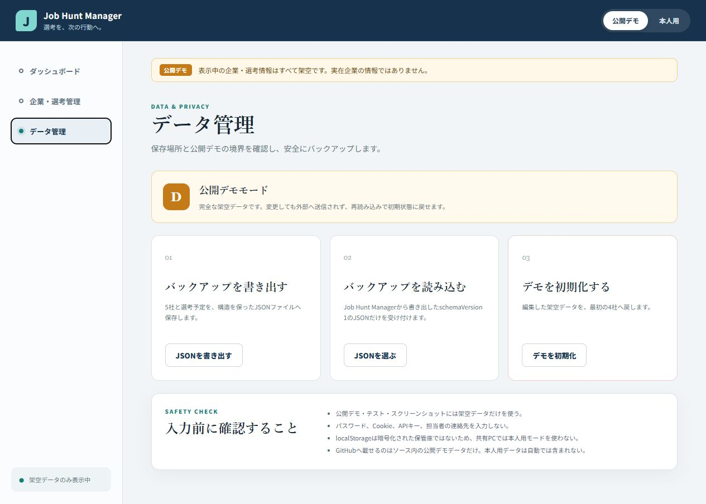
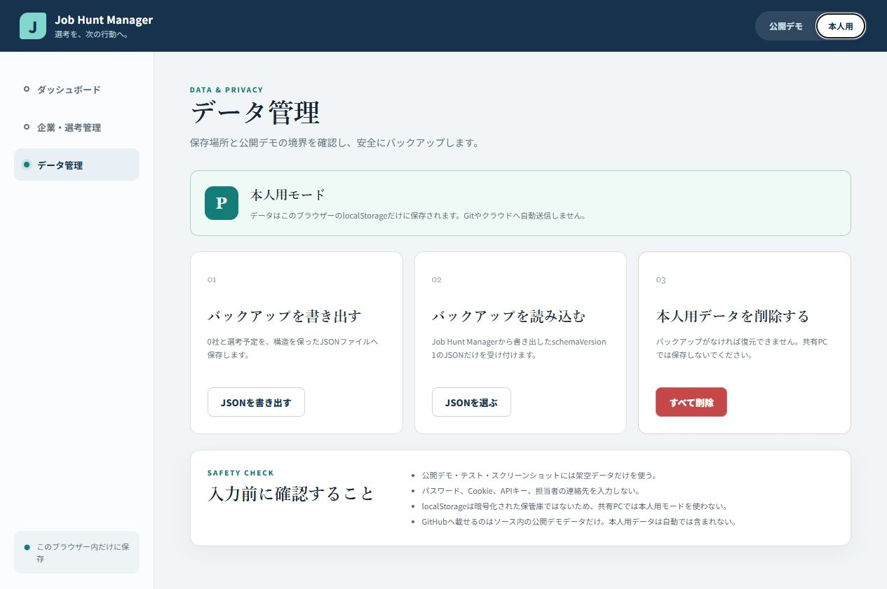

# Phase 7: 保存・バックアップ・モード分離

## 1. このフェーズで何をしたか
本人用localStorage保存、公開デモのリセット、JSON書き出し・検証付き読み込みを実装しました。
## 2. なぜこの作業が必要なのか
再読み込み後も使え、実データが公開用ダミーデータへ混ざらないようにするためです。
## 3. 作業前はどういう状態だったか
データは画面を閉じると消え、デモと本人用の境界は設計だけでした。
## 4. 何を変更したか
`storage.ts`、モード切替、`DataTools.tsx`、schemaVersion付きバックアップを追加しました。
## 5. 作業後どうなったか
本人用だけブラウザー保存され、デモは架空データへ戻せます。不正JSONは既存データへ反映しません。
## 6. スクリーンショット

## 7. スクリーンショットの見方
モード名・保存説明・削除操作が切り替わり、本人用で0社になっている点を見ます。
## 8. 変更した主なファイル
- `src/services/storage.ts`: 保存、復元、形式検証
- `src/components/DataTools.tsx`: バックアップUI
- `src/data/demoData.ts`: 公開可能な架空データ
## 9. 使用した主なコマンド
- `pnpm run test`: 保存・壊れたJSON・バックアップ形式を確認。
- `pnpm run test:e2e`: 登録後に再読み込みして残ることを確認。
## 10. 発生したエラー
保存処理自体のエラーはありません。設計時に外部DB案との選択が課題でした。
## 11. 原因
複数端末同期の価値と、無課金・個人情報・初心者理解の負担が競合したためです。
## 12. どう直したか
初版はlocalStorageに限定し、保存サービスを分離して将来APIへ交換可能にしました。
## 13. このフェーズで覚える言葉
localStorage、JSON、schemaVersion、永続化、インポート。
## 14. 面接用30秒説明
「本人用はlocalStorage、公開デモはソース内ダミーへ分離しました。バックアップは選考の入れ子構造を保てるJSONとし、バージョンと最低限の形を検証します。」
## 15. 理解度チェック
1. 本人用データはGitに入りますか。2. schemaVersionは何のためですか。3. localStorageの弱点は何ですか。
## 16. 理解度チェックの答え
1. 自動では入らない。2. 将来の形式差を判別する。3. 端末/ブラウザー依存で暗号化保管庫ではない。
## スクリーンショット安全確認
0社の本人用画面と架空デモだけで、localStorageの内容自体は写していません。
## 5分復習
- 覚える3点: モード分離、localStorage、JSON検証。
- 覚えなくてよい: Blob URLの細部。
- 面接までに: 外部DBを使わなかった判断を説明する。
