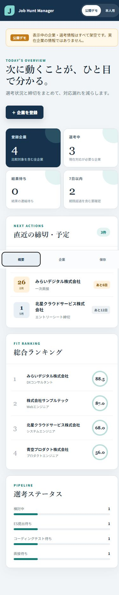

# Phase 8: UI/UXと狭い画面対応

## 1. このフェーズで何をしたか
締切の警告色、優先度・状態のラベル、読みやすい余白、モーダル、スマートフォン幅の下部ナビを整えました。
## 2. なぜこの作業が必要なのか
就活では情報量が多く、重要な締切を短時間で判断できることが見た目以上に重要だからです。
## 3. 作業前はどういう状態だったか
機能はありましたが、画面幅ごとの配置と視線誘導の最終確認が未完了でした。
## 4. 何を変更したか
レスポンシブCSS、固定ナビ、フォーカス表示、見出し、警告色、ARIAラベルを調整しました。
## 5. 作業後どうなったか
390px幅でも見出し、登録ボタン、集計、締切、ランキングへアクセスできます。
## 6. スクリーンショット

## 7. スクリーンショットの見方
4つの集計が2列、主なパネルが1列、メニューが下部の3項目になる点を見ます。
## 8. 変更した主なファイル
- `src/styles.css`: 820px/600pxの画面幅調整
- `src/components/AppShell.tsx`: 常に意味が分かるARIAラベル
## 9. 使用した主なコマンド
- browser viewport 390×844: 実際の狭い画面を再現。
- `pnpm run lint`: UI変更後のコード検査。
## 10. 発生したエラー
最初の狭い画面確認で、非表示になった長いラベルのため自動操作上のメニュー名が短縮されました。
## 11. 原因
CSSの `display:none` はアクセシビリティツリーからも要素を外すためです。
## 12. どう直したか
各ナビボタンへ常に完全名の `aria-label` を付けました。
## 13. このフェーズで覚える言葉
responsive、breakpoint、ARIA、focus、visual hierarchy。
## 14. 面接で聞かれた場合の説明例
「締切を見落とさない視線順と、スマートフォン幅の1列表示を設計しました。見た目だけでなくARIAラベルも実画面確認から改善しました。」
## 15. 理解度チェック
1. 警告色の目的は何ですか。2. ARIAラベルは誰に役立ちますか。3. 390pxで集計は何列ですか。
## 16. 理解度チェックの答え
1. 緊急度を素早く判断。2. 支援技術と自動操作。3. 2列。
## スクリーンショット安全確認
ブラウザーのWebアプリ部分だけで、端末通知やデスクトップは含みません。
## 5分復習
- 覚える3点: レスポンシブ、視線誘導、ARIA。
- 覚えなくてよい: 全CSS値。
- 面接までに: 見た目の判断を利用課題へ結びつける。

