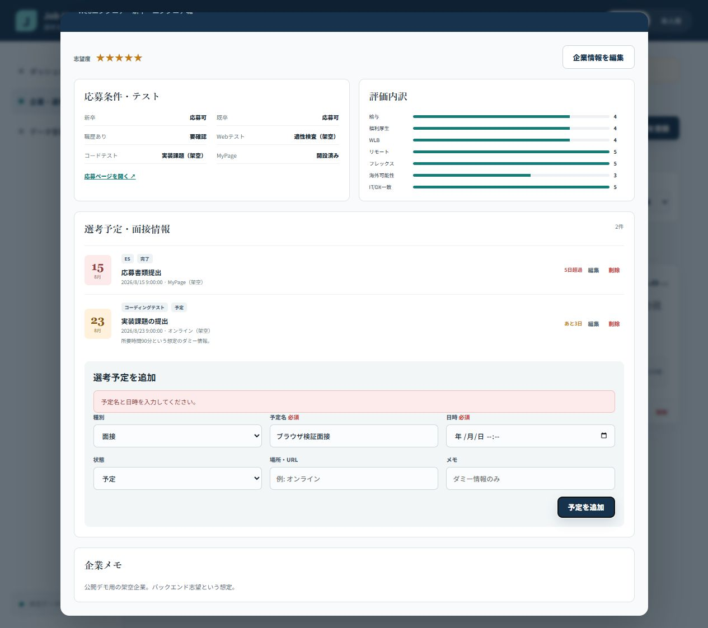

# Phase 9: テストとエラー修正

## 1. このフェーズで何をしたか
lint、TypeScript build、17件の単体/画面テスト、3件のEdge E2E、実画面とコンソール確認を行いました。
## 2. なぜこの作業が必要なのか
「表示できた」だけでなく、登録・保存・検索・状態変更が再現可能に動くと示すためです。
## 3. 作業前はどういう状態だったか
主要機能は実装済みでしたが、環境差や回帰を確認していませんでした。
## 4. 何を変更したか
Vitest、Testing Library、Playwright、各種テスト、ID生成修正、テスト対象分離を追加しました。
## 5. 作業後どうなったか
ロジック、画面、実ブラウザーの3段階で必須フローを確認できました。
## 6. スクリーンショット

## 7. スクリーンショットの見方
日時が空のまま追加せず、フォーム上部に理由を表示している点を見ます。
## 8. 変更した主なファイル
- `src/**/*.test.ts(x)`: 17件の自動テスト
- `e2e/core-flow.spec.ts`: 公開デモと本人用CRUD
- `playwright.config.ts`: 既存Edgeを使うE2E設定
## 9. 使用した主なコマンド
- `pnpm run lint`: 規約・書き間違い確認。
- `pnpm run build`: 型検査と完成版生成。
- `pnpm run test`: 17項目を自動実行。
- `pnpm run test:e2e`: 3つの実ブラウザーフロー。
## 10. 発生したエラー
Vitestが最初は `e2e/*.spec.ts` まで単体テストとして読み、Playwrightの `test()` を誤った場所で実行しました。
## 11. 原因
VitestとPlaywrightが同じ `.spec.ts` 命名を使い、Vitestの既定探索範囲が広かったためです。
## 12. どう直したか
Vitest対象を `src/**/*.test.{ts,tsx}` へ限定し、E2EはPlaywrightだけが読むよう分離しました。
## 13. このフェーズで覚える言葉
unit test、component test、E2E、lint、regression。
## 14. 面接で聞かれた場合の説明例
「計算と保存を単体テスト、利用者操作をTesting Library、再読み込みを含むCRUDをEdge E2Eで確認しました。実ブラウザーで見つけたID生成バグも再テストしています。」
## 15. 理解度チェック
1. 単体テストとE2Eの違いは何ですか。2. lintとtestの違いは何ですか。3. なぜ両方必要ですか。
## 16. 理解度チェックの答え
1. 小さな処理対ブラウザー全体。2. コード検査対動作検査。3. 原因特定の速さと実環境の確かさを両立するため。
## スクリーンショット安全確認
架空企業と空の日時だけで、実面接情報はありません。
## 5分復習
- 覚える3点: 3層テスト、randomUUIDバグ、テスト範囲分離。
- 覚えなくてよい: テスト実行時間の細部。
- 面接までに: どのテストが何を保証するか説明する。
