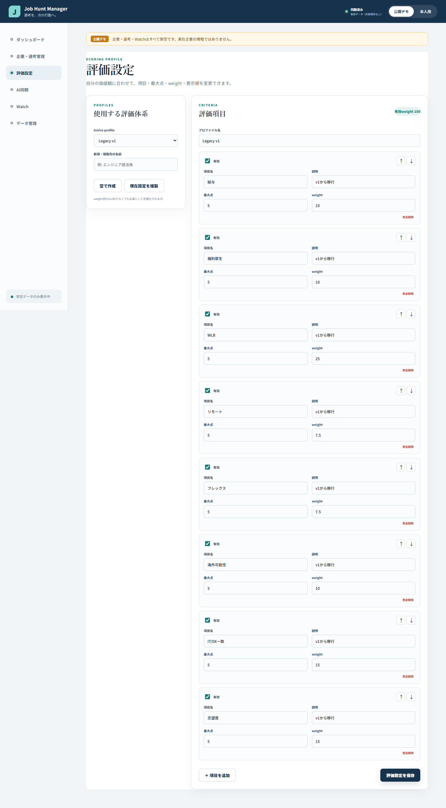

# Phase 12: 変更可能な評価プロファイルと動的ランキング

## 1. このフェーズで何をしたか

固定された8項目のランキングを廃止し、ユーザーが評価項目、最大点、weight、有効状態、表示順を変更できるScoring Profileへ置き換えました。未評価を0点にしない暫定スコアと評価充足率も実装しました。

## 2. なぜこの作業が必要なのか

就活で重視する条件は人や時期によって異なります。固定式では「なぜこの順位なのか」を本人が説明できず、項目を追加しただけで未評価企業が不当に0点扱いされる問題もあるためです。

## 3. 変更前

- 給与、福利厚生、WLB等の項目と重みが`scoring.ts`へ固定されていました。
- 全企業が同じ最大5点・同じ評価体系を使っていました。
- 評価項目の追加、無効化、並べ替え、プロファイル切替はできませんでした。
- 総合点だけが表示され、どこまで評価済みか分かりませんでした。

## 4. 変更内容

- 安定したIDを持つ`ScoringProfile`と`Criterion`を追加しました。
- プロファイルの新規作成、複製、active切替を実装しました。
- 項目名・説明・`scaleMax`・`weight`・有効状態・表示順を編集可能にしました。
- 通常の削除は無効化とし、完全削除には確認を要求しました。
- 評価済みかつ有効な項目だけで、`100 × Σ((score / scaleMax) × weight) / Σ(評価済みweight)`を計算します。
- `coverage`は、評価済みweightを有効な全weightで割って計算します。
- `null`は0点ではなく未評価とし、評価がなければ総合点を表示しません。
- `coverage < 100`では「暫定」と充足率を表示します。
- 項目名やweightの変更では既存評価値を保持し、最大点変更では確認後に同じ百分率へ比例変換します。
- 同点時はcoverage、企業表示名、IDで順序を決め、同じスコアは同順位にしました。

## 5. 変更後

利用者自身が評価理由を組み立てられ、weight合計が100でなくても比率として正しく再計算されます。ランキングは企業適合度として扱い、締切の緊急度とは分離しました。scoringとprofile managementの15テストを含むunit/component test 119件が成功しています。

## 6. スクリーンショット

## 7. スクリーンショットの見方

active profileの選択、プロファイル作成・複製、各項目の有効状態、項目名、最大点、weight、上下移動を確認します。表示値は公開デモ用で、個人の評価データは使用していません。

## 8. 主なファイル

- `src/domain/scoring.ts`: テンプレート、動的スコア、coverage、比例変換
- `src/domain/profileManagement.ts`: 作成、複製、切替、保存、並べ替え
- `src/domain/selectors.ts`: 決定的なランキングと同順位
- `src/components/ScoringSettings.tsx`: 評価設定画面
- `src/components/CompanyForm.tsx`: active profileに応じた動的評価入力
- `src/domain/scoring.test.ts`: 計算境界の10テスト
- `src/domain/profileManagement.test.ts`: 設定変更の5テスト

## 9. 主なコマンド

- `pnpm run test -- src/domain/scoring.test.ts`: 満点、任意scale、任意weight、null、coverageを確認。
- `pnpm run test -- src/domain/profileManagement.test.ts`: 名前・weight・最大点・順序・プロファイル操作を確認。
- `pnpm run test`: unit/component test 119件を一括確認。
- `pnpm run build`: 画面とdomain型の統合を確認。

## 10. 発生したエラー

v2画面の統合途中に、TypeScriptが`Company[]`を`CompanyView[]`へ渡せないというエラーを検出しました。

## 11. 原因

評価設定と一覧側はv2の`CompanyView`へ更新済みでしたが、ルートの`App.tsx`が一時的にv1の`Company[]`状態を渡していたためです。旧モデルと新モデルが画面境界で混在していました。

## 12. 修正

ルート状態を`AppDataV2`へ統一し、`getCompanyViews`でMaster、Fact、Evaluation、Scoreを組み立てて各画面へ渡しました。その後、型検査と119件のテストを再実行しました。

## 13. 覚える言葉

- **Scoring Profile**: 評価項目の組み合わせをまとめた設定。
- **Criterion ID**: 名前を変えても評価値との対応を保つ識別子。
- **weight**: 各項目を相対的にどれだけ重視するか。
- **normalization**: 異なる最大点を同じ0〜1の比率へ直すこと。
- **coverage**: 有効な評価全体のうち、評価済みweightが占める割合。

## 14. 面接30秒説明

「固定ランキングを、利用者ごとのScoring Profileへ変更しました。各項目は安定ID、任意の最大点とweightを持ち、未評価は0点ではなく計算対象外です。総合点とは別にcoverageを出して暫定表示し、最大点変更時は百分率を保って既存値を変換するため、順位の理由を説明できます。」

## 15. 理解度チェック

1. weight合計が100でなくてもよいのはなぜですか。
2. 未評価を0点にしない理由は何ですか。
3. 項目名を変更しても評価値が残るのはなぜですか。
4. 最大点を5から10へ変えたとき、4点は何点になりますか。

## 16. 答え

1. 評価済みweightの合計で割り、比率として正規化するためです。
2. 「まだ調べていない」と「調べた結果0点」は意味が違うためです。
3. 表示名ではなく変わらないCriterion IDで評価値を結び付けるためです。
4. 同じ80%を保つため8点です。

## 17. 5分復習

- 1分: provisional scoreとcoverageの式を確認する。
- 1分: `null`と0点の違いを説明する。
- 1分: 名前・weight・最大点変更時の挙動を比較する。
- 1分: スクリーンショット上で設定可能な箇所を指す。
- 1分: 面接30秒説明を資料なしで話す。
