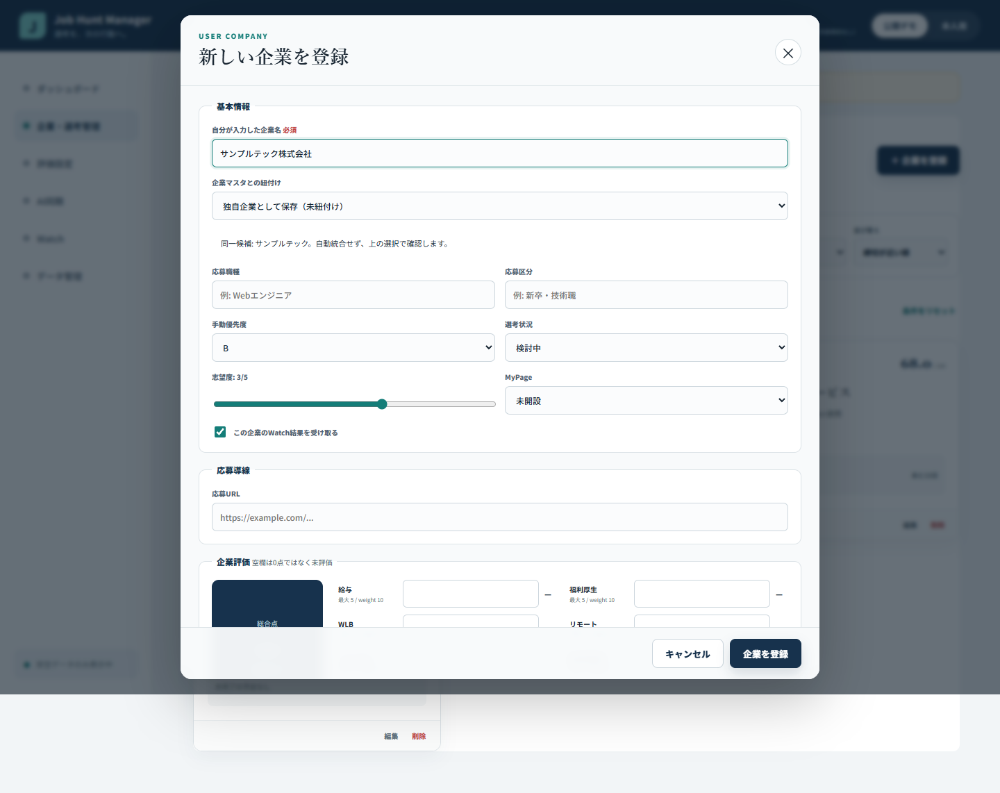

# Phase 13: Company Masterと安全な企業名照合

## 1. このフェーズで何をしたか

企業そのものを表すCompany Masterと、本人が管理するUser Companyを分離しました。表記揺れや公式ドメインから候補を探しつつ、文字列だけで自動統合しない候補確認フローを実装しました。

## 2. なぜこの作業が必要なのか

企業名は法人表記、全角半角、旧社名、ブランド名で揺れます。一方、似た名称の別企業も存在するため、企業名を主キーにしたり、正規化一致だけで統合したりすると、別企業の選考・メモ・評価を混ぜる危険があるためです。

## 3. 変更前

- v1では本人が入力した企業名が企業を見分ける中心でした。
- 共通企業情報と本人の応募情報が同じ`Company`に入っていました。
- 社名変更、合併、別名、公式ドメインを表す恒久IDはありませんでした。
- 後から共通企業へ紐付ける安全な手順がありませんでした。

## 4. 変更内容

- `MasterCompany`へ名称から生成しない恒久ID、slug、正式名、表示名、aliases、formerNames、officialDomains、status、mergedIntoIdを定義しました。
- `UserCompany`は`masterCompanyId: string | null`を持ち、未紐付けの独自企業としても保存できるようにしました。
- `CatalogRepository`境界と、同梱の架空企業だけを返す`StaticCatalogRepository`を作りました。
- 候補検索ではUnicode NFKC、trim、大小文字、連続空白、候補照合時だけの法人表記除去を行います。
- 公式ドメインを正規化し、名称候補より強い理由として候補順へ反映しました。
- 存在する`masterCompanyId`が明示された場合だけ確定扱いにし、alias・正規化名・domain一致は候補表示に留めました。
- 候補が1件でも複数件でも自動統合せず、ユーザーがフォームの選択肢から確認します。
- 候補なしでは`masterCompanyId: null`の独自企業として登録できます。
- merged IDはcanonical Masterへ解決し、循環があれば停止します。
- 後からMasterへ紐付けても、User Companyの選考、メモ、志望度、イベント、評価を保持します。

## 5. 変更後

表示名が変わっても恒久IDで企業を追跡でき、本人データはUser Company側に残ります。候補表示は入力を助けますが、曖昧な一致で別企業を黙って混ぜません。Company Masterの5テストを含むunit/component test 119件が成功しています。

## 6. スクリーンショット

## 7. スクリーンショットの見方

入力名に対して同一候補が表示されても自動選択されず、「企業マスタとの紐付け」で本人が決められる点を確認します。「独自企業として保存」も残っており、画像は公開デモ用の架空企業だけです。

## 8. 主なファイル

- `src/domain/types.ts`: `MasterCompany`、`CatalogData`、`UserCompany`
- `src/domain/companyMatching.ts`: 名称・domain正規化、候補検索、canonical解決、紐付け
- `src/domain/companyMatching.test.ts`: 正規化、明示ID、alias/domain候補、候補なし、link後のデータ保持を確認する5テスト
- `src/domain/aiSync.test.ts`: AI取込で複数候補がある場合に自動統合せず停止するテスト
- `src/repositories/catalog.ts`: CatalogRepositoryと静的実装
- `src/data/catalogData.ts`: 公開可能な架空Master Catalog
- `src/components/CompanyForm.tsx`: 候補表示、手動選択、独自企業登録

## 9. 主なコマンド

- `pnpm run test -- src/domain/companyMatching.test.ts`: 候補照合と紐付けを確認。
- `pnpm run test`: unit/component test 119件を一括確認。
- `pnpm run lint`: 候補UIとdomainコードを静的検査。
- `pnpm run build`: 型と画面統合を確認。

## 10. 発生したエラー

検証用シェルで`node --version`を実行した際、Node実行ファイルがPATHに含まれず「nodeが認識されない」という環境エラーが発生しました。Company Masterの照合ロジック自体の失敗ではありませんでした。

## 11. 原因

実行環境にはNode本体がありましたが、サンドボックスのシェルPATHにはpnpmのshimだけが入り、Nodeのディレクトリが含まれていなかったためです。

## 12. 修正

Node実行ファイルの場所を読み取り確認し、その明示パスでVitestとESLintを実行しました。Company Masterの5テストと全119件を再確認し、機能側を環境エラーに合わせて変更することはしませんでした。

## 13. 覚える言葉

- **Master Company**: 複数ユーザーから共通参照できる企業そのもの。
- **User Company**: 本人の応募状況、メモ、予定、評価を持つ関係データ。
- **canonical ID**: 合併や名称変更後も最終的に参照する正規のID。
- **normalization**: 照合候補を探すため表記差をそろえる処理。
- **candidate matching**: 自動確定せず、同一かもしれない候補を提示する処理。

## 14. 面接30秒説明

「企業そのものと本人の応募情報を分け、企業名ではなく恒久Master IDで結び付けました。NFKC、法人表記、alias、公式domainから候補を探しますが、文字列一致は確定根拠にせず必ず候補表示に留めます。未紐付け企業も使え、後から紐付けても選考やメモはUser Company側に保持されます。」

## 15. 理解度チェック

1. なぜ正規化した企業名をMaster IDにしないのですか。
2. aliasが完全一致したときも自動統合しない理由は何ですか。
3. `masterCompanyId: null`にはどんな意味がありますか。
4. merged Masterを参照した場合はどうなりますか。

## 16. 答え

1. 名称は変わり、異なる企業が同じ正規化結果になる可能性もあるためです。
2. 表記一致だけでは同一法人だと断定できず、本人データを誤って混ぜる危険があるためです。
3. Catalogにない、またはまだ確認していない企業を独自企業として管理している状態です。
4. `mergedIntoId`をたどってcanonical Masterを返し、循環や参照切れでは安全に停止します。

## 17. 5分復習

- 1分: Master CompanyとUser Companyの所有情報を分けて書く。
- 1分: 明示ID、名称、domain、候補なしの照合結果を説明する。
- 1分: なぜ候補1件でも自動統合しないか説明する。
- 1分: スクリーンショットの手動選択箇所を確認する。
- 1分: 面接30秒説明を資料なしで話す。
