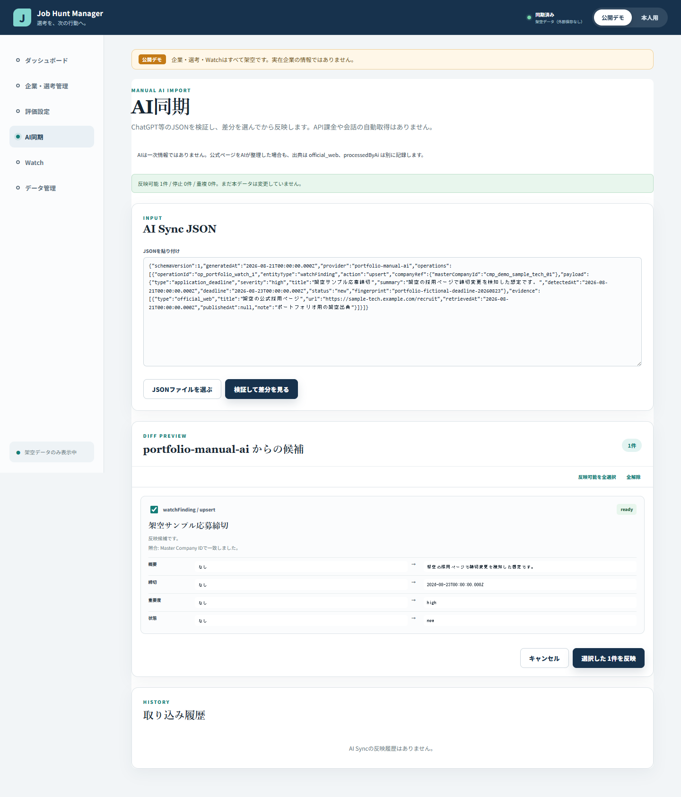
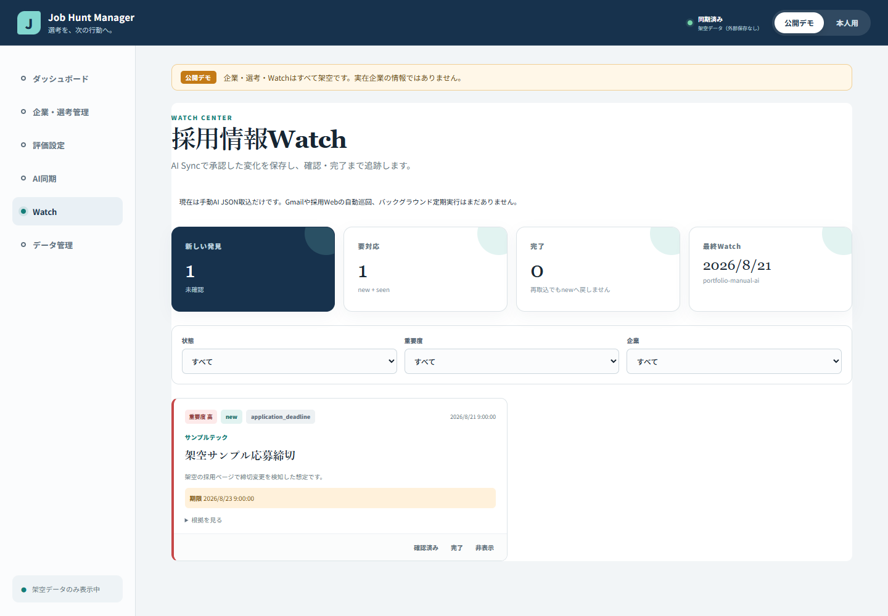

# Phase 14: AI Sync・Watch Center

## 1. このフェーズで何をしたか

ChatGPT等が作成した構造化JSONを検証し、差分を確認してから選択反映できるAI Syncと、承認した変化を確認・完了まで管理するWatch Centerを追加しました。今回動作するWatch Providerは手動AI JSON取込だけです。

## 2. なぜこの作業が必要なのか

毎朝の調査結果を巨大な文章や会話履歴のまま持つと、前回との差、根拠、締切、対応済みかどうかを安定して追跡できません。AIをデータの正本にせず、AIが整理した候補を利用者が確認してJob Hunt Managerへ保存するために必要でした。

## 3. 変更前

企業、選考予定、調査情報をアプリ内で管理する仕組みはありましたが、ChatGPT等の調査結果を共通形式で受け取り、反映前に差分を確認する画面はありませんでした。また、毎日の変化を`new`、`seen`、`completed`等で継続管理する場所もありませんでした。

## 4. 変更内容

- `AiSyncEnvelopeV1`をZodでruntime validationし、壊れたJSON、schema違反、http/https以外のURLを拒否しました。
- `operationId`による二重反映防止と、企業照合が複数候補になった場合の自動反映停止を実装しました。
- 読込時は本データを変更せず、現在値、候補値、出典、確認日を差分表示するpreviewを実装しました。
- 利用者が個別選択して承認した操作だけを新しいstateへ反映し、deleteには追加確認を要求しました。
- Research Fact、Selection Event、Watch Findingのupsertと取込履歴を実装しました。
- Watch Findingを`fingerprint`で重複排除し、完了済みのFindingを同じ再取込で`new`へ戻さないようにしました。
- 「今日の要対応」を期限帯、severity、企業適合度、企業名、IDの説明可能な規則で安定ソートできるようにしました。
- Gmail連携と採用Web自動巡回は将来用contractだけとし、動作しているように見せる機能は追加していません。

## 5. 変更後

現在の運用は「ChatGPTで調査 → AI Sync JSONを貼付または選択 → validation → 差分preview → 個別承認 → Research Fact／選考予定／Watchへ反映」です。同じ`operationId`や同じFindingを再度取り込んでも大量の重複が作られず、どの情報がAI整理で、どのSourceに基づくかをデータとして残せます。

## 6. スクリーンショット

どちらも公開デモの完全な架空企業・架空採用情報だけを使用しています。実企業名、実応募状況、実メール、個人メモは含みません。

## 7. スクリーンショットの見方

1枚目では、JSONを読み込んだだけでは本データが変わらず、操作ごとの状態、企業照合、変更前後、出典を確認してからチェック単位で反映できる点を見ます。2枚目では、新しい発見、要対応、完了、最終Watchを分け、企業・状態・重要度で絞り込める点を見ます。画面上にも「手動AI JSON取込だけ」であることを明記しています。

## 8. 主なファイル

- `src/domain/aiSync.ts`: Envelope schema、parse、企業照合、差分preview、選択commit、取込履歴。
- `src/domain/watch.ts`: Finding重複排除、status変更、今日の要対応の透明な並び順。
- `src/providers/watch.ts`: `ManualAiImportWatchProvider`と将来Providerのcontract。
- `src/components/AiSync.tsx`: JSON入力、差分表示、個別選択、承認UI。
- `src/components/WatchCenter.tsx`: 集計、フィルター、Finding状態変更UI。
- `src/domain/aiSync.test.ts`、`src/domain/watch.test.ts`: domainの安全性と計算規則。
- `src/components/AiSync.test.tsx`、`src/components/WatchCenter.test.tsx`: 利用者操作と表示のcomponent test。
- `docs/09_AI_SYNC_FORMAT.md`、`docs/10_WATCH_ARCHITECTURE.md`: 取込形式と将来境界。

## 9. 主なコマンド

- `pnpm run test`: AI Sync、Watch、既存機能を含むunit/component testを実行。
- `pnpm exec vitest run src/domain/aiSync.test.ts src/domain/watch.test.ts`: domainだけを絞って再確認。
- `pnpm exec vitest run src/components/AiSync.test.tsx src/components/WatchCenter.test.tsx`: 差分承認とWatch画面操作を再確認。
- `pnpm run lint`: 未使用変数や規約違反を確認。
- `pnpm run build`: TypeScript検査と本番用bundle生成。

## 10. エラー

最初の対象テスト実行では、展開済み`node_modules`内のpnpmリンクがコピー前の生成状態と一致せず、`vitest`をコマンドとして解決できませんでした。

## 11. 原因

`node_modules`はソースではなく環境ごとに生成される成果物であり、pnpmはpackage storeへのリンクを使います。ZIP化や別作業環境への展開後も、そのリンク構造が正常であるとは限りません。

## 12. 修正

`package.json`と`pnpm-lock.yaml`を正本として依存関係を再構築し、対象テスト、全unit/component test、lint、TypeScript、buildを再実行しました。ソースやGit履歴を依存関係修復のために削除していません。

## 13. 覚える言葉

- runtime validation: TypeScriptの外から来たJSONを実行時にも検証すること。
- diff preview: 保存前に現在値と候補値の違いを見せること。
- transaction: 全検証後にまとめて確定し、途中失敗で元データを壊さない考え方。
- idempotency: 同じ操作を再送しても結果が重複しない性質。
- fingerprint: 同じFindingかを判定するための安定した識別値。
- provider boundary: 手動AI、将来のGmail、Web調査をUIから切り離す境界。

## 14. 面接30秒説明

「ChatGPTの調査結果を直接上書きせず、Zodで検証し、企業照合と人が読める差分previewを通して選択承認するAI Syncを実装しました。Watch FindingはoperationIdとfingerprintで重複を防ぎ、完了状態を保持します。今回は手動JSON取込までで、GmailやWebの自動巡回は将来機能と明記しています。」

## 15. 理解度チェック

1. なぜAI JSONを読み込んだ時点で本データへ反映しないのですか。
2. `operationId`とFindingの`fingerprint`はそれぞれ何を防ぎますか。
3. AIが公式ページを整理した場合、Sourceと`processedByAi`をどう記録しますか。
4. なぜ今回のWatchはブラウザーを閉じた後も毎朝自動実行できないのですか。

## 16. 答え

1. JSONの破損、誤った企業照合、不要な変更を人が確認し、既存データを守るためです。
2. `operationId`は同じ取込操作の二重反映、`fingerprint`は同じ発見の重複作成を防ぎます。
3. Sourceは実際の`official_web`、AIが整理した事実は`processedByAi: true`として別々に記録します。AI自体を一次情報扱いしません。
4. React SPAだけでは、ブラウザー終了中の定期処理や安全なtoken管理を行えないためです。将来は本人同意、Google審査要件、バックエンドまたはschedulerの設計が必要です。

## 17. 5分復習

- 1分: AI Syncの`parse → validate → match → preview → select → commit`を声に出す。
- 1分: Sourceと`processedByAi`が別である理由を説明する。
- 1分: `operationId`と`fingerprint`の違いを説明する。
- 1分: 今日の要対応と企業ランキングが別概念である理由を説明する。
- 1分: 今回できる手動取込と、未実装のGmail／Web自動巡回を区別して説明する。
