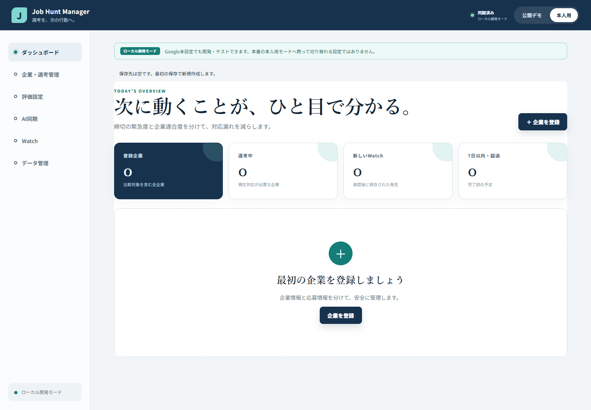

# Phase 15: Google認証・Drive appDataFolder同期基盤

更新日: 2026-08-21

## 1. このフェーズで何をしたか

Google Identity Services（GIS）のToken model、Google Drive `appDataFolder`用の保存Repository、ローカル開発用Repository、同期競合の停止処理を実装しました。外部JSONはv1/v2とも実データへ反映する前に検証・previewし、v1原文と競合時のローカル案を退避できるようにしました。

## 2. なぜこの作業が必要なのか

v1のlocalStorageだけでは、PCとスマートフォンで同じ本人データを安全に利用できませんでした。一方、UIからDrive APIを直接呼ぶと、認証、再試行、競合、保存先変更が画面へ混ざります。そこで`AuthProvider`と`StorageRepository`を境界にし、UIを全面変更せず保存先を交換できる形にしました。

## 3. 変更前

- 本人用データの正本は1ブラウザーのlocalStorageでした。
- Googleログインと複数端末同期はありませんでした。
- v1バックアップは読み込めましたが、v2の構造と競合情報はありませんでした。
- 同時編集時のDrive `version`とAppData `revision`を比較する仕組みはありませんでした。

## 4. 変更内容

- `StorageRepository`へ`exists`、`load`、`save`、JSON export、v1/v2 import preview、確認後commitの契約を定義しました。
- `LocalDevelopmentStorageRepository`は画面にローカル開発モードを明示し、v1移行前に原文をlegacy keyへ保存します。
- `GoogleDriveStorageRepository`は`job-hunt-manager-data-v2.json`をDrive UIから見えない`appDataFolder`へ保存します。
- GIS Token modelが要求するscopeを`openid email profile https://www.googleapis.com/auth/drive.appdata`だけに固定しました。
- access tokenはProviderのメモリ内だけに置き、localStorage、sessionStorage、IndexedDBへ保存しません。
- 一時的な403理由、429、500、502、503、504だけを、jitter付き指数バックオフで有限回再試行します。
- 保存直前にremoteを再読込し、Drive `version`またはAppData `revision`が基準と違えば上書きを停止します。
- 競合時にはローカル案をJSONとして退避できる情報を返します。
- logoutでメモリ上のtoken、アカウント表示、Personal stateをclearし、account switchでは旧tokenを破棄して選び直します。

## 5. 変更後

開発・E2EはGoogle設定なしのローカル開発モードで進められ、本番用コードは限定scopeのGoogle認証とDrive appDataFolderへ差し替えられるようになりました。実Googleアカウント、Client ID、2FAを使った接続試験は本人操作が必要なため未実施です。成果物では「Google Drive同期確認済み」とは表現せず、「Mock/contract確認済み、実アカウント未確認」と区別します。

## 6. スクリーンショット

この画像には架空企業だけを使い、Googleアカウント、OAuth token、実就活情報、Windowsデスクトップ全体を含めません。

## 7. スクリーンショットの見方

画面上部の「ローカル開発モード」表示を確認します。Google Client IDがない開発環境が、利用者に気づかれないまま本番の本人用保存へ切り替わっていない点が重要です。この画像はGoogle Driveの実接続成功を示す証跡ではありません。

## 8. 主なファイル

- `src/repositories/types.ts`: StorageRepository、load/save結果、import preview、競合JSONの型
- `src/repositories/localDevelopmentStorage.ts`: 開発用保存、v1原文退避、検証後commit
- `src/repositories/googleDriveStorage.ts`: appDataFolder REST transport、再試行、version/revision競合停止
- `src/providers/auth.ts`: AuthProviderとscope allowlist
- `src/providers/googleAuth.ts`: GIS Token model、UserInfo、logout、account switch
- `src/App.tsx`: 認証・保存Repositoryと既存UIの統合
- `docs/08_GOOGLE_DRIVE_SYNC.md`: 同期設計と制約
- `docs/GOOGLE_AUTH_SETUP.md`: 本人が行うGoogle Cloud設定手順

## 9. 主なコマンド

- `pnpm install --frozen-lockfile`: ZIP由来の壊れたpnpmリンクをlockfileから再構築。
- `pnpm run test`: unit/component testを実行。
- `pnpm run lint`: TypeScript/Reactコードを静的検査。
- `pnpm run build`: TypeScript検査とproduction buildを実行。
- `rg`: Gmail scope、広いDrive scope、secret、token永続化がないか確認。

## 10. エラー

最初の検証では、ZIP化された既存`node_modules`のpnpmリンクとACLが壊れ、`tsc`、`eslint`、`vitest`を解決できませんでした。また、実Google認証はClient IDと本人ログインがないため試験できませんでした。

## 11. 原因

`node_modules`はソースではなく環境依存の生成物であり、pnpmのリンク構造を保ったままZIPで移動できるとは限りません。Google認証側は、パスワード、2FA、OAuth Client作成を本人以外が代行してはいけないためです。

## 12. 修正

対象がプロジェクト直下の`node_modules`だけであることを確認して生成物を削除し、`pnpm-lock.yaml`から再構築しました。Google側は実アカウントを要求しないMock transport/Authで、empty remote、existing remote、save、load、retry、permanent failure、conflict、v1原文退避、未ログイン、ログイン成功・失敗、logout、account switchを検証しました。Storage/Auth担当のMockテストは28件すべて成功しました。

競合検知は保存前のremote再取得で上書きを止めますが、その確認と実際のPATCHの間にはrace windowが残ります。公式仕様で原子的な条件付き更新を確認できていないため、「完全な競合防止」や「自動merge」とは説明しません。

## 13. 覚える言葉

- **GIS Token model**: ブラウザーから利用者操作で短期access tokenを取得する方式。
- **scope**: アプリへ許可するデータ範囲。今回はidentity 3種と`drive.appdata`だけ。
- **appDataFolder**: アプリ専用で、通常のDrive UIには表示されない保存領域。
- **Repository**: UIと保存方法を切り離す境界。
- **revision / version**: AppData側とDrive側の変更状態を判定する値。
- **exponential backoff**: 一時エラー時に待ち時間を増やしながら有限回再試行する方法。
- **race window**: 事前確認後、実際の更新までに別変更が入り得る時間差。

## 14. 面接30秒説明

「localStorageだけだった本人用保存をRepositoryへ分離し、Google Identity ServicesのToken modelとDrive appDataFolder対応へ発展させました。scopeはopenid、email、profile、drive.appdataだけで、tokenはメモリ保持です。Drive versionとAppData revisionが変わっていれば上書きを止め、ローカル案をJSON退避します。Mock 28件は成功していますが、実Google接続と競合確認にはrace windowがあることも明記しています。」

## 15. 理解度チェック

1. `drive.appdata`を使い、`drive`を使わない理由は何ですか。
2. access tokenをlocalStorageへ保存しない理由は何ですか。
3. Drive `version`とAppData `revision`のどちらかが変わった場合、何をしますか。
4. Mockテスト成功と実Google接続成功は同じ証跡ですか。
5. 保存前確認だけで競合を完全に防げない理由は何ですか。
6. Google APIの利用料金について、この成果物で断言できる範囲はどこまでですか。

## 16. 答え

1. アプリ専用の隠し領域だけへ権限を限定し、利用者の通常のDriveファイルへ広くアクセスしないためです。
2. XSS等で読み出される永続的な場所を避け、logoutや期限切れ時に確実に破棄しやすくするためです。
3. 自動上書きせず競合として停止し、remote再読込またはローカルJSON退避を利用者に選んでもらいます。
4. 同じではありません。Mock/contractはコードの分岐を確認し、実接続は本人のClient ID、同意画面、Googleアカウントで別途確認します。
5. remote確認とPATCHが1つの原子的処理ではなく、その間に別端末が更新できるrace windowが残るためです。
6. Google公式の標準利用は現時点で追加費用なしと案内されていますが、quotaや将来の超過課金方針は変更され得ます。本プロジェクトではBilling account、カード、quota引上げを設定せず、Billing接続を求められたら作業を停止して最新公式情報を本人が確認します。

## 17. 5分復習

- 1分目: `AuthProvider`と`StorageRepository`を分けた理由を話す。
- 2分目: 4つの許可scopeと、禁止したDrive/Gmail scopeを確認する。
- 3分目: loadからsaveまでのversion/revision比較を図なしで説明する。
- 4分目: Mock 28件で確認したものと、実Google未確認の範囲を分ける。
- 5分目: race window、JSON退避、Billingを接続しない方針を説明する。

公式資料: [GIS Token model](https://developers.google.com/identity/oauth2/web/guides/use-token-model)、[Drive appDataFolder](https://developers.google.com/workspace/drive/api/guides/appdata)、[Drive error handling](https://developers.google.com/workspace/drive/api/guides/handle-errors)、[Drive limits](https://developers.google.com/workspace/drive/api/guides/limits)
