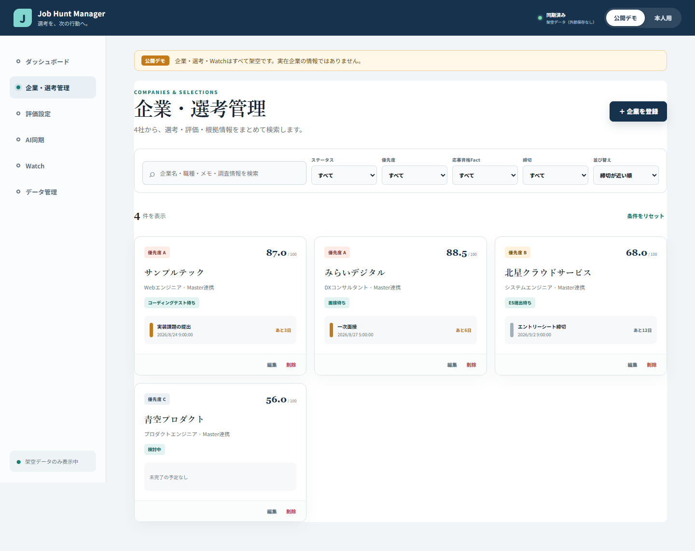
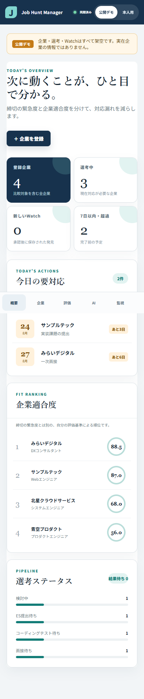

# Phase 17: v2リリース監査

更新日: 2026-08-21

## 1. このフェーズで何をしたか

v2の全機能を統合した状態で、lint、TypeScript、unit/component、production build、Microsoft Edge E2Eを再実行しました。Playwrightの撮影先をv2専用Phaseへ分離し、完全な架空データだけでPC幅・390px幅・Company Master候補・評価設定・AI差分・Watch・ローカル開発モードを撮影しました。最後にGit、秘密情報、個人情報、Google scope、文書と実装の整合性を監査しました。

## 2. なぜこの作業が必要なのか

個別機能が動いても、統合後に既存CRUD、移行、画面、文書、スクリーンショットがずれていれば公開可能な成果物とはいえません。特に過去Phaseの画像は当時の学習証跡なので、v2撮影で上書きせず、履歴と現在の両方を正確に残す必要がありました。

## 3. 変更前

- v2の機能実装と分野別テストは完了していましたが、最終の一括監査は未完了でした。
- 既存の撮影テストはPhase 3〜5の歴史画像へ書き込む構造で、v2実行時に過去証跡を上書きする危険がありました。
- `docs/FINAL_AUDIT.md`と証跡INDEXはv1時点の18テスト・3 E2Eの記録でした。
- Google実アカウント接続は、本人のClient IDと同意操作がないため未試験でした。

## 4. 変更内容

- 撮影先をPhase 12〜15、Phase 17、portfolioのv2専用パスへ変更しました。
- 旧画像が変化していないことをGitで確認し、Webアプリ領域だけを再撮影しました。
- unit/component 119件、機能E2E 6件、証跡撮影2件、lint、型検査、buildを再実行しました。
- 外部JSONのID・参照整合性、AI取込後の再検証、Watch Run、Repository経由backup importを追加監査しました。
- 同期競合中は本人用画面をread-onlyにし、local案を自動退避してからremoteを再読込する導線を確認しました。
- 実ブラウザーで企業管理、評価設定、AI同期、Watchの各画面を開き、コンソールエラーが0件であることを確認しました。
- Google実接続、Gmail自動監視、Web定期巡回、外部公開を未実装・未確認として文書へ残しました。
- Git追跡対象にsecret、`.env.local`、`node_modules`、`dist`、個人データがないことを監査しました。

## 5. 変更後

v2はローカル開発モードと架空デモで再現可能になり、GitHubへ掲載できるコード・テスト・設計・学習証跡が揃いました。Google認証とDriveは実装およびMock/contract検証までで、本人の実Googleアカウントを使う接続確認だけは残っています。外部公開、課金設定、GitHub pushは行っていません。

## 6. スクリーンショット

関連画面は次にもあります。

- [動的評価設定](../phase-12-configurable-scoring/screenshots/01-scoring-settings.png)
- [Company Master候補](../phase-13-company-master/screenshots/01-master-candidate.png)
- [AI差分preview](../phase-14-ai-sync-watch/screenshots/01-ai-diff-preview.png)
- [Watch Center](../phase-14-ai-sync-watch/screenshots/02-watch-center.png)
- [ローカル開発モード](../phase-15-google-drive/screenshots/01-local-development-mode.png)

## 7. スクリーンショットの見方

ダッシュボードでは「今日の要対応」と「企業適合度」が別のカードになっている点、企業一覧ではMaster紐付けと独自企業を区別できる点、モバイルでは下部ナビゲーションが固定されても内容を隠さない点を確認します。すべて架空企業で、Windowsデスクトップ、Googleアカウント、実応募情報は写していません。

## 8. 主なファイル

- `e2e/core-flow.spec.ts`: 企業・選考CRUD、評価、AI Sync、Watch、v1移行、v2 backupの6フロー。
- `e2e/screenshots.spec.ts`: v2専用のPC・モバイル証跡撮影2件。
- `docs/FINAL_AUDIT.md`: Function、Migration、Google、Security、Git、Data、AI、Docs、Evidence、Portfolioの最終結果。
- `docs/evidence/INDEX.md`: Phase 0〜17の学習順。
- `docs/portfolio/`: 面接説明、初心者向け構成、実際の開発ストーリー、AI利用説明。
- `docs/public/`: 公開前に本人確認・法的レビューが必要な方針ドラフト。

## 9. 主なコマンド

- `pnpm run lint`: ESLint。成功。
- `pnpm exec tsc -p tsconfig.app.json --noEmit`: 型検査。成功。
- `pnpm run test`: 24 files、119 tests。成功。
- `pnpm run build`: 143 modulesをproduction build。成功。
- `pnpm run test:e2e`: Edgeで機能6件＋撮影2件、計8件。成功。
- `git diff --check`と`git status`: 差分形式と変更範囲を確認。
- `git ls-files`と`rg`: 生成物、secret、scope、実データ候補を監査。

## 10. エラー

最初の撮影実行はsandboxからVite設定を読む際にAccess deniedとなりました。また実ブラウザー確認で`networkidle`待機を指定したところ、その接続では未対応というエラーになりました。さらに監査途中で、旧撮影specがPhase 3〜5の画像を上書きし得ることをGit差分から発見しました。

## 11. 原因

Vite/esbuildの設定読込は実行環境の権限制約へ触れました。ブラウザー接続が対応する待機状態は`load`まででした。旧撮影specはv1公開時の出力先を固定しており、v2でも同じファイル名を使う構造だったことが証跡衝突の原因です。

## 12. 修正

対象をローカルアプリのテストだけに限定して許可された環境で再実行し、撮影2件を成功させました。実ブラウザーは`load`待機へ切り替えました。旧画像は開始時点のGit内容へ戻し、撮影specをPhase 12〜17の新規パスだけへ変更してから再撮影しました。エラーを隠さず、原因と修正をこの証跡へ残しました。

## 13. 覚える言葉

- release audit: 公開前に機能・安全・文書・証跡を横断して確認する作業。
- regression: 新しい変更によって以前の機能が壊れること。
- tracked file: Gitが内容を追跡しているファイル。
- generated artifact: `dist`や`node_modules`のように再生成できる成果物。
- contract test: 外部サービスなしで、自分のコードが守る入出力契約を確認するテスト。
- limitation: 未実装または未確認であり、利用者へ明示すべき制約。

## 14. 面接30秒説明

「v2の完成時には119件のunit/component、Edgeの機能E2E 6件と撮影2件、lint、型検査、production buildを通しました。過去の学習画像をv2撮影で上書きする問題もGit差分で見つけ、新Phaseへ分離しました。Google DriveはMock/contractまで確認し、本人アカウントでの実接続は未試験と明記することで、実装済みと将来機能を区別しています。」

## 15. 理解度チェック

1. 機能E2Eと撮影テストを分けて数える理由は何ですか。
2. 過去Phaseの画像をv2で上書きしてはいけない理由は何ですか。
3. Google Driveについて「確認済み」と言える範囲はどこまでですか。
4. 最終監査でコード以外に確認するものを4つ挙げてください。

## 16. 答え

1. 機能E2Eは操作と状態変化、撮影テストは現在UIの証跡生成という異なる目的を持つためです。
2. 過去画像は当時の実装と学習過程を示す履歴であり、書き換えると実際の開発ストーリーが失われるためです。
3. Repository、GIS境界、限定scope、Mockによるload/save/retry/conflictまでです。本人ログインと実Driveへの保存・端末間同期は未確認です。
4. 例としてGit履歴、秘密情報、個人情報、依存生成物、文書、スクリーンショット、AI利用記録、未実装表現です。

## 17. 5分復習

- 1分: 119 unit/component、6機能E2E、2撮影テストの役割を説明する。
- 1分: 過去画像の上書きをGitでどう発見し、どう防いだか話す。
- 1分: Google Driveの確認済み範囲とrace windowを説明する。
- 1分: Gmail/Web自動監視が今回未実装である理由を説明する。
- 1分: 最終監査の10観点を自分の言葉で挙げる。
