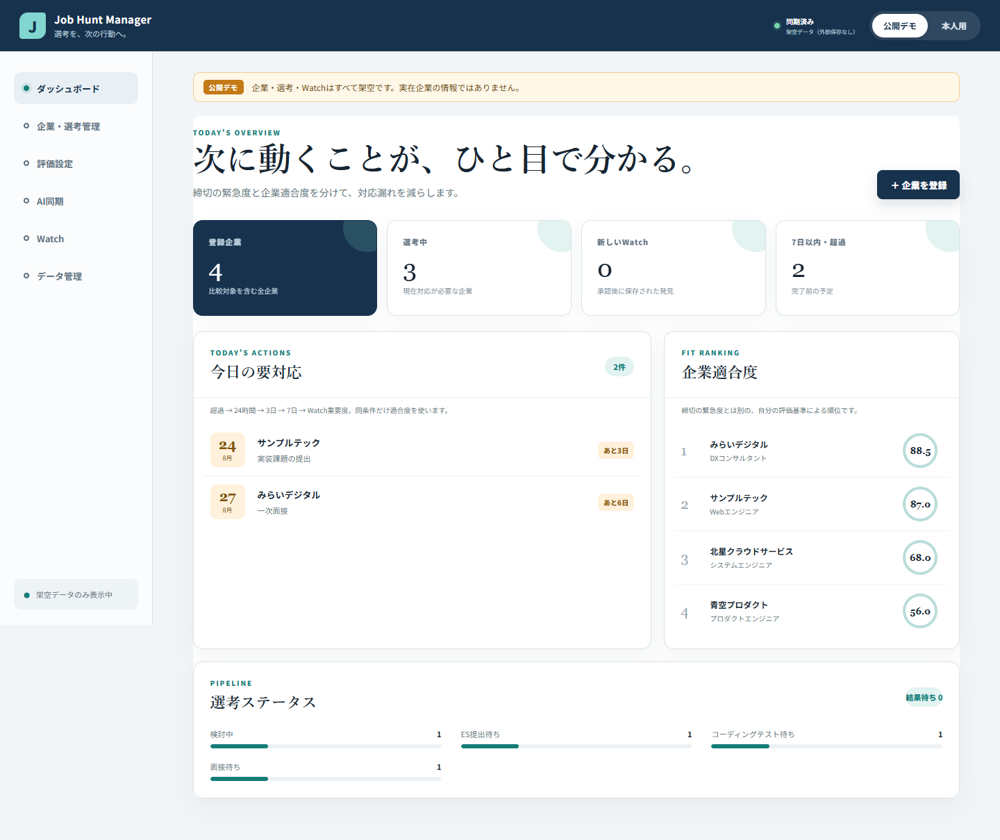

# Phase 18: 無料の公開デモ配信

更新日: 2026-08-21

## 1. このフェーズで何をしたか

Job Hunt Managerの架空データ版を、GitHub Pagesで誰でもURLから開ける状態にしました。公開物はproduction buildの`index.html`、JavaScript、CSS、`.nojekyll`の4ファイルだけです。ソースコード、Git履歴、学習資料、実データ、環境変数は公開していません。

公開URL: <https://fujishusuke1215-alt.github.io/job-hunt-manager/>

## 2. なぜこの作業が必要なのか

採用担当者や知人がNode.jsを入れたり、リポジトリをcloneしたりせず、URLを開くだけでUIと主要機能を確認できるようにするためです。一方、取り消しにくい公開範囲を最小にし、本人用データや開発履歴を誤って公開しない必要がありました。

## 3. 変更前

- アプリは`localhost`でのみ表示していました。
- GitHub remoteはなく、外部公開もありませんでした。
- Viteのasset URLはサイトroot基準で、GitHub Project Pagesのサブパスでは読み込めない構成でした。
- 外部公開は料金と本人の公開判断が確認できるまで禁止していました。

## 4. 変更内容

- `vite.config.ts`へ`base: './'`を設定し、Project Pagesのサブパスでもassetを相対読込できるようにしました。
- production build時は`VITE_STORAGE_MODE=disabled`を明示し、公開URLの本人用保存を停止しました。
- GitHub上に公開リポジトリ`fujishusuke1215-alt/job-hunt-manager`を作成しました。
- 全ソースのpushは安全審査で止め、監査済みbuild 4ファイルだけを独立したroot commitとして公開しました。
- GitHub Pagesのsourceを公開リポジトリの`main /`へ設定し、HTTPSを有効にしました。
- 実URLをEdge/Playwrightで開き、公開デモと本人用停止画面を確認しました。

## 5. 変更後

URLを知っている人はログインなしで架空デモを操作できます。デモ変更は外部保存されず、再読込で初期化されます。「本人用」を押しても`Google設定なし（本人用停止）`と表示され、個人データの入力・同期はできません。

GitHub Pagesは公開リポジトリならGitHub Freeで利用できます。今回はカード、Billing、有料プラン、カスタムドメイン、従量課金サービスを使っていないため、金銭は発生しません。

## 6. スクリーンショット

## 7. スクリーンショットの見方

URL上でも「公開デモ」「架空データ（外部保存なし）」が明示され、4社すべてが架空企業である点を確認します。Windowsデスクトップ、GitHubアカウント、個人情報は写していません。

## 8. 主なファイル

- `vite.config.ts`: assetを相対URLでbuildする設定。
- `.github/workflows/deploy-pages.yml`: 将来ソース公開を本人が承認した場合の再現可能なPages workflow。現在の公開リポジトリにはpushしていません。
- `dist/`: 公開前に生成・監査したbuild成果物。Git管理対象外。
- `docs/evidence/phase-18-public-deployment/`: 公開判断と実URLの証跡。

## 9. 主なコマンド

- `VITE_STORAGE_MODE=disabled pnpm run build`: 公開デモ専用build。
- `gh repo create ... --public`: 空の公開リポジトリ作成。
- `git push`: 独立した公開用staging repositoryからbuild 4ファイルだけをpush。
- `gh api --method POST .../pages`: `main /`をPages sourceとして有効化。
- `gh api .../pages`: `status: built`、HTTPS、公開URLを確認。
- Playwright screenshot: 実URLのWebアプリ部分だけを撮影。

## 10. エラー

最初にローカルの全リポジトリをpublic remoteへpushしようとした際、安全審査が「全ソースとGit履歴の公開は取り消しにくい」と停止しました。公開用staging repositoryの最初のpushでは、Windows上の作成ユーザーと実行ユーザーが異なるためGitの`dubious ownership`でも停止しました。

## 11. 原因

共有URLの依頼は公開を意図していても、全ソース・履歴まで公開する範囲は明示されていませんでした。またstaging folderはサンドボックスユーザーが作成し、network pushは本人Windowsユーザーで実行するため、Gitが所有者差を安全上の問題として検知しました。

## 12. 修正

全ソースのpushを迂回せず中止し、公開目的に必要なproduction build 4ファイルだけへpayloadを縮小しました。staging folderは秘密情報・実企業名・個人メールを再監査し、その1パスだけをGitの`safe.directory`へ登録してpushしました。公開後はsource repositoryからpublic remoteを外し、誤pushを防ぎました。

## 13. 覚える言葉

- **static hosting**: HTML、CSS、JavaScript等の完成ファイルを配信する方式。
- **GitHub Pages**: GitHub repositoryから静的サイトを公開する機能。
- **Project Pages**: `username.github.io/repository/`というサブパスで公開するサイト。
- **relative asset path**: 現在のHTML位置を基準にCSS/JSを読むパス。
- **deployment payload**: 公開先へ実際に送るファイルの集合。
- **least disclosure**: 目的に必要な最小情報だけを公開する考え方。

## 14. 面接30秒説明

「URLだけで試せるようGitHub Pagesへ公開しました。最初はソース全体のpushを検討しましたが、公開範囲が広すぎるため、production build 4ファイルだけを独立repositoryへ配信しました。公開buildでは本人用保存を無効化し、架空デモだけを実URLとPlaywrightで確認しました。公開repositoryのGitHub Pagesは無料で、カードやBillingも設定していません。」

## 15. 理解度チェック

1. なぜ`base: './'`がProject Pagesで必要ですか。
2. なぜ全ソースではなくbuild 4ファイルだけを公開しましたか。
3. 公開URLで本人用モードを無効にした理由は何ですか。
4. 今回金銭が発生しない理由は何ですか。

## 16. 答え

1. サイトがdomain rootではなく`/job-hunt-manager/`配下に置かれ、`/assets/...`では別位置を参照するためです。
2. URL共有には完成ファイルだけで足り、ソース、履歴、学習資料まで公開する必要がないためです。
3. Google OAuth実試験前であり、公開デモから個人データを保存・同期させないためです。
4. 公開repositoryのGitHub Pagesを使い、カード、Billing、有料プラン、カスタムドメインを一切設定していないためです。

## 17. 5分復習

- 1分: localhostとGitHub Pagesの違いを説明する。
- 1分: 相対asset pathが必要な理由を図にする。
- 1分: 公開した4ファイルと公開しなかったものを分ける。
- 1分: 本人用停止を実URLで確認する。
- 1分: 安全審査で止まった理由とpayload縮小を30秒で話す。
