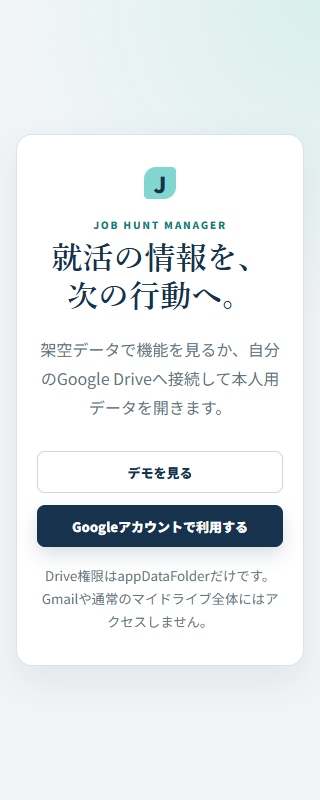
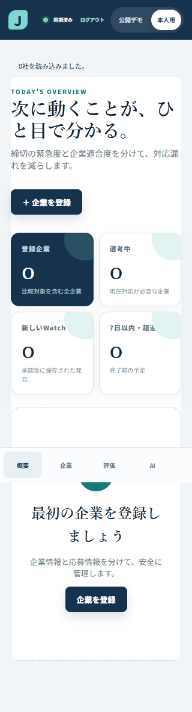

# Phase 19: GitHub PagesへGoogle本人用Drive同期を統合

更新日: 2026-08-21

## 1. このフェーズで何をしたか

公開URLへ「デモを見る」と「Googleアカウントで利用する」の入口を追加し、既存のGIS/Drive基盤をGitHub Pages production buildへ接続しました。401再接続、端末v1/v2移行、Driveと端末の選択、account A/B分離、Repository Variable連携を追加しました。

## 2. なぜ必要か

Phase 18はURL共有用の架空デモだけでした。今回は同じ静的URLを維持しながら、利用者ごとの就活データを開発者のDBへ集約せず、各自のGoogle Driveへ保存する必要がありました。

## 3. 変更前

- 公開buildは`VITE_STORAGE_MODE=disabled`で本人用停止。
- Client IDをGitHub Actionsへ渡す設定がない。
- 401は一般的なoffline表示だけで、再接続導線がない。
- Driveが空のときlocalStorage v1だけを候補にし、v2や両方存在時の選択UIがない。
- Google接続を含むスマホ幅E2Eがない。

## 4. 変更内容

- GIS Token modelとDrive `appDataFolder` Repositoryをproduction workflowで有効化。
- `VITE_GOOGLE_CLIENT_ID`をGitHub Repository Variableから注入。
- access token期限切れ/401で未保存stateを保持し、ユーザー操作の再接続後に再保存。
- localStorage v1/v2をruntime validationし、Driveが空なら三択、両方あれば更新時刻付き三択を表示。
- logout時にPersonal stateを先にclearし、別アカウントの読込前に旧stateを破棄。
- 320px幅でGoogle A保存→logout→Google B読込をモックE2E。
- `<meta name="robots" content="noindex,nofollow">`を追加。ただし認証やデータ保護の代わりではありません。

## 5. 変更後

公開入口からデモと本人用を選べます。本人用はClient ID設定後、Google accountごとの`appDataFolder`を読みます。個人データ、token、Client SecretはGitHub repositoryへ保存しません。Google実アカウント試験はまだ未実施です。

## 6. スクリーンショット

## 7. スクリーンショットの見方

1枚目はURL直後の二択です。2枚目は完全な架空アカウントと空データを使った320px幅のモックです。access token、実メール、実就活情報、Windowsデスクトップは写していません。

## 8. 主なファイル

- `src/App.tsx`: 入口、再接続、移行/選択、logout分離。
- `src/services/localDriveCandidate.ts`: local v1/v2候補の検証。
- `src/providers/googleAuth.ts`: GISとメモリtoken。
- `src/repositories/googleDriveStorage.ts`: appDataFolderと有限retry/競合停止。
- `.github/workflows/deploy-pages.yml`: Repository Variableを含むPages build。
- `e2e/google-drive-flow.spec.ts`: Google/Driveのブラウザーモック。
- `docs/12_GITHUB_PAGES_GOOGLE_DRIVE.md`: 公開コードと個人データの分離図。

## 9. 主なコマンド

- `pnpm run test`: 25 files / 130 tests。
- `pnpm run lint`: ESLint。
- `pnpm run build`: production build。
- `pnpm exec playwright test --config playwright.google.config.ts`: Google/DriveモックE2E。
- `pnpm run test:e2e`: 従来8件とGoogle/Driveモック1件。

## 10. エラー

最初のcomponent testは公開入口追加後も旧「本人用」ボタンを探して失敗しました。スマホ幅E2Eではメール表示の`small`がCSSで非表示となり、接続完了を視覚locatorで確認できませんでした。最初のVite buildはsandbox外側の親directory読取が拒否されました。

## 11. 原因

テストが変更前UIへ依存していたこと、モバイルで接続情報とlogout操作を隠していたこと、esbuildが設定解決時にworkspace境界外を確認しようとしたことが原因でした。アプリのDrive API処理そのものの失敗ではありません。

## 12. 修正

公開入口の意味に合わせてテストを更新し、同期状態のaccessible nameへ接続済みメールを含めました。モバイルでもlogout/再接続ボタンを操作可能にし、E2Eで確認しました。Vite/Vitest/Playwrightは公式の`--configLoader runner`を使い、workspace外をbundle探索せず、通常の`pnpm run build/test/test:e2e`で再確認しました。

## 13. 覚える言葉

- **origin**: schemeとhost、portからなるWebアプリの出所。pathは含まない。
- **Repository Variable**: 非秘密のbuild設定をGitHub Actionsへ渡す値。
- **browser token model**: ユーザー操作中だけ短命tokenでAPIを呼ぶSPA向け方式。
- **appDataFolder**: Drive UIから見えない、アプリ専用のユーザー別領域。
- **reauthorization**: token期限後にユーザー操作で再度権限を得ること。

## 14. 面接30秒説明

「静的なGitHub Pagesを維持しながら、GISのToken modelとDrive appDataFolderを使ってユーザー別保存を追加しました。tokenはメモリだけに置き、401時は編集内容を保持して再接続します。Driveと端末の両方にデータがあれば更新時刻と選択肢を出し、自動上書きしません。130件のunit/componentと9件のPlaywrightまで確認し、実Google接続だけは本人試験前と明記しています。」

## 15. 理解度チェック

1. なぜGitHub Pagesへ個人JSONを置かなくてもアプリを共有できますか。
2. Authorized JavaScript originに`/job-hunt-manager/`を含めない理由は何ですか。
3. tokenをlocalStorageへ保存しない理由は何ですか。
4. Driveと端末の両方にデータがあるとき、なぜ自動上書きしませんか。

## 16. 答え

1. Pagesはコードを配り、個人JSONは各Google accountのappDataFolderへ保存するためです。
2. originはscheme、host、portだけで定義され、pathを含まないためです。
3. XSS等で長く再利用される危険を減らし、Google公式の短命token運用に合わせるためです。
4. 別端末の新しい変更や旧端末の必要データを黙って失う可能性があるためです。

## 17. 5分復習

- 1分: GitHub PagesとDriveの責務を図で説明する。
- 1分: 4つのscopeと禁止scopeを言う。
- 1分: 401再接続で未保存stateをどう扱うか説明する。
- 1分: local v1/v2とDriveの選択肢を説明する。
- 1分: 実Google未試験と静的SPAの制約を説明する。
